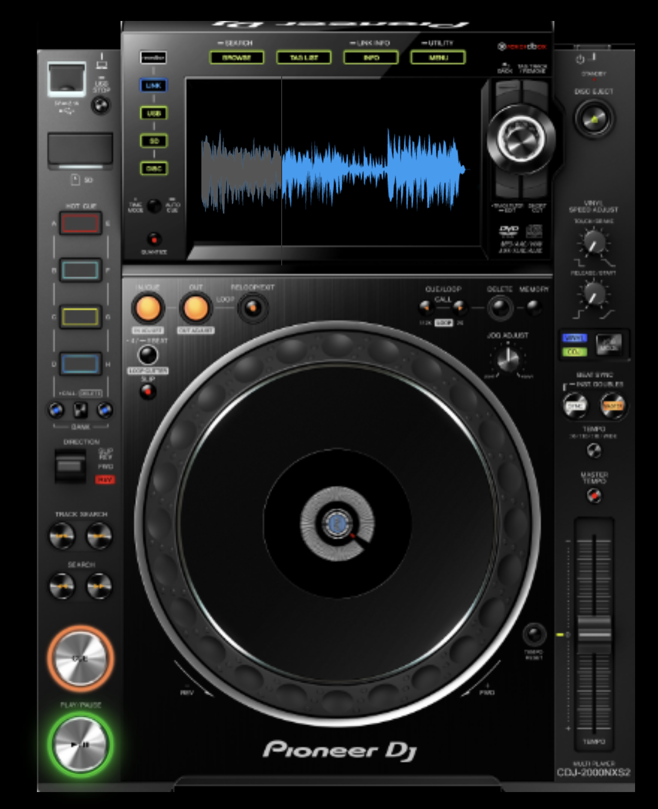

# Shiny and the Web

**Learning objectives:**

- Basic introduction to web apps and shiny
- Purpose of HTML, CSS, JavaScript
- How to create HTML in R
- How to add HTML, CSS, JavaScript to a shiny app

## Introduction {-}

The data scientist route to web apps:

- Learn R/Python ==> use `{shiny}` ==> make an apps in **minutes**

The typical route

- Learn HTML ==> learn CSS ==> learn JS ==> learn frontend/backend libraries

- Make web apps at each stage

```{r}
library("shiny")
```

## Shiny generates HTML code {-}

```{r hello_element, results="asis"}
h1("Hello world") |> message()
```

- We just made HTML from R.

- Being able to generate HTML code from R allows the developer to **remain focused** on the main task.

Shiny apps can be deeply **customized** with

- Custom HTML (for content)
- Custom CSS (for styling)
- Custom JavaScript (for interactivitiy)
- ... and make use of many templates and packages that are already written

## Be a DJ {-}

Here is [36 lines of shiny code](https://github.com/DivadNojnarg/OSUICode/blob/master/inst/intro/dj-system/app.R) (plus a few images and styles etc).

```r
remotes::install_github("Athospd/wavesurfer")
OSUICode::run_example("intro/dj-system", package = "OSUICode")
```

<p style="text-align:center;"> 
{width=50%}
</p>


## HTML tags basic types {-}

HTML = "HyperText Markup Language"

- __Paired__

```
<!-- paired-tags -->
<p>A paragraph</p>
<div></div>
```

- __Self-closing__

```

<iframe/>
<input/>
<br/>
```

## HTML tags role types {-}

- __Structure__ tags to constitute the skeleton of the HTML page

```html
<head></head>
<title></title>
<body></body>
```

- __Control__ tags to include external resources, provide interactivity with the user.
  - script
  - inputs
  - buttons
  
- __Formatting__ tags to change wrapped text properties like its _size_ and _font_.


## Box Model {-}

All elements displayed are contened by a box with properties like:

- Padding: Internal margins.
- Margins: Space between multiple elements.
- Width
- Height

<p style="text-align:center;"> 
{width=65%}
</p>

- defines the margins and dimensions of each element

"Flow layout":

- Block elements = full-width
- Inline elements = same line
- Inline-block = Inline element within which you can add block elements

"Semantic meaning"

- `<header>Content for the header element</header>`

## Tag attributes

Add properties to your HTML elements!

- `id` = must be unique
- `class` = may be shared by multiple elements

```html
<div class="awesome-item" id="this-item"></div>
<span class="awesome-item"></span>
```

## The simplest HTML skeleton {-}

"Hello, World!" in HTML:

```html
<!DOCTYPE HTML>
<html lang="en">
  <head>
    <!-- head content here -->
    <title>A title</title>
  </head>
  <body>
    <p>Hello World</p>
  </body>
</html>
```

<div style="border: 1px solid black;">
 <p>Hello World</p>
</div>

We made an HTML element using shiny above.
Now let's make a whole web page:

## The simplest HTML skeleton {-}

```r
# Not ran
ui <- fluidPage(p("Hello, World!"))
server <- function(input, output, session) {}

shinyApp(ui, server)
```

<div style="border: 1px solid black;">
 <p>Hello World</p>
</div>

Run this app.
Then inspect the source.

## The DOM

Document Object Model:

- Computational representation of an app
- Use browser devtools to access it
- [MDN "Manipulating documents"](https://developer.mozilla.org/en-US/docs/Learn/JavaScript/Client-side_web_APIs/Manipulating_documents)

### Visualising the DOM

Open the "Hello, World!" app in the browser and click "Inspect"

The inspector allows:

- Dynamic changes to CSS
- Debugging JS
- Run JS from a console
- Modify warnings / errors
- Switch devices (e.g., mimic mobile)
- Do performance audit

Exercise:

- Open "Hello, World!"
- Open the inspector
- Edit the paragraph text
- Add children to paragraph tag

## CSS and JavaScript

1991 - The [first website](http://info.cern.ch/hypertext/WWW/TheProject.html)

1995 - JavaScript = Interactivity

1996 - CSS = Styling

### HTML and CSS

CSS specifies how collections of elements should be displayed
Elements are picked by class, id, or other properties.

In shiny, we can add CSS for styling in a few ways:

```r
ui <- fluidPage(
  tags$style("p {color: red;}"),
  p("Hello, World!")
)
server <- function(input, output, session) {}
shinyApp(ui, server)
```

### HTML and JavaScript

With JS, we can respond to user clicks (amongst many other things):

```r
ui <- fluidPage(
  tags$script(
    "alert('Click on the Hello World text!');
     // change text color
     function changeColor(color){
       document.getElementById('hello').style.color = color;
     }
    "
  ),
  p(id = "hello", onclick="changeColor('green')", "Hello World")
)

server <- function(input, output, session) {}

shinyApp(ui, server)
```

## Summary

Shiny builds interactive web apps from R.
You can add custom CSS, JS and HTML to your shiny apps.

## Meeting Videos

### Cohort 1

`r knitr::include_url("https://www.youtube.com/embed/eabiEX8MNmQ")`

<details>
<summary> Meeting chat log </summary>

```
00:04:28	Arthur Shaw: @russ, you audio may not be hooked up yet
00:04:45	Arthur Shaw: In Zoom, we can see "Connecting to audio" under your video
00:05:09	Arthur Shaw: You may have a poor physical connection. Lots of static
00:05:27	Arthur Shaw: Same issue
00:17:47	Trevin: I'm also in the Mastering Shiny book club with Lucio 🙂
00:20:09	Federica Gazzelloni: https://developer.mozilla.org/en-US/docs/Web/JavaScript/Guide
00:20:57	Lucio Cornejo: This book seems more robust in the frontdns side. JavaScript for R felt mostly R like
00:21:02	Lucio Cornejo: frontend*
00:38:53	Jack Penzer: When writing custom html, the inputId in a shiny function is defined as id = in the html?
00:39:46	Lucio Cornejo: yes, it mainly copies the usual html attributes.
00:40:36	Lucio Cornejo: so something like "class = 'some-name'" also work as an argument
00:51:44	Jack Penzer: 👍
01:02:46	Lucio Cornejo: I'll be doing chapter 2
01:03:45	Trevin: Thanks for starting us off Russ!
01:03:53	Lucio Cornejo: No questions from me. Thank you Russ
01:04:12	Jack Penzer: Away skiing next week but will be back the following week!
```
</details>
