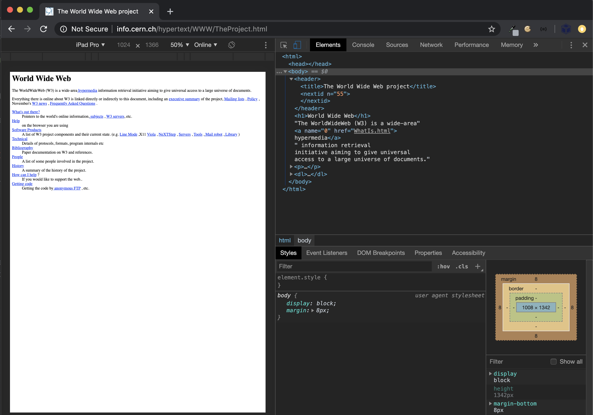

# Shiny and the Web

**Learning objectives:**

-   Basic introduction to web apps and shiny
-   Purpose of HTML, CSS, JavaScript
-   How to create HTML in R
-   How to add HTML, CSS, JavaScript to a shiny app

## Introduction {.unnumbered}

The data scientist route to web apps:

-   Learn R/Python ==\> use `{shiny}` ==\> make an apps in **minutes**

The typical route

-   Learn HTML ==\> learn CSS ==\> learn JS ==\> learn frontend/backend libraries

-   Make web apps at each stage

## Shiny generates HTML code {.unnumbered}

```{r hello_element, results="asis"}
shiny::h1("Hello world") |> message()
```

-   We just made HTML from R.

-   Being able to generate HTML code from R allows the developer to **remain focused** on the main task.

Shiny apps can be deeply **customized** with

-   Custom HTML (for content)
-   Custom CSS (for styling)
-   Custom JavaScript (for interactivitiy)
-   ... and make use of many templates and packages that are already written

## Be a DJ {.unnumbered}

Here is [36 lines of shiny code](https://github.com/DivadNojnarg/OSUICode/blob/master/inst/intro/dj-system/app.R) (plus a few images and styles etc).

``` r
remotes::install_github("Athospd/wavesurfer")
OSUICode::run_example("intro/dj-system", package = "OSUICode")
```

<p style="text-align:center;">
{width="50%"}
</p>

## HTML tags basic types {.unnumbered}

HTML = "HyperText Markup Language"

-   **Paired**

```         
<!-- paired-tags -->
<p>A paragraph</p>
<div></div>
```

-   **Self-closing**

```         

<iframe/>
<input/>
<br/>
```

## HTML tags role types {.unnumbered}

-   **Structure** tags to constitute the skeleton of the HTML page

``` html
<head></head>
<title></title>
<body></body>
```

-   **Control** tags to include external resources, provide interactivity with the user.
    -   script
    -   inputs
    -   buttons
-   **Formatting** tags to change wrapped text properties like its *size* and *font*.

``` html
<b></b>
<i></i>
```

## Box Model {.unnumbered}

All elements displayed are contained by a box with properties like:

-   Padding: Internal margins.
-   Margins: Space between multiple elements.
-   Width
-   Height

<p style="text-align:center;">

{width="65%"}

</p>

## Flow Layout {.unnumbered}

Defines how the elements are displayed.

| **Block elements**                                                        | **Inline elements**                                                                                 |
|:-----------------------------------|:-----------------------------------|
| \- Take the full width <br> - May contain other tags <br> - `<div></div>` | \- Are printed on the same line <br> - Can not contain block tags <br> - `<span></span>`, `<a></a>` |

<p style="text-align:center;">

{width="80%"}

</p>

> **Inline-block** can contain block tags in an inline.

## Semantic tags {.unnumbered}

They allow developers to **structure the HTML page**.

``` html
<header></header>
<footer></footer>

# In a basic HTML document, it will not automatically create a sidebar.
<aside></aside>
```

<p style="text-align:center;">

{width="80%"}

</p>

## Tag attributes {.unnumbered}

Add properties to your HTML elements!

-   **id**: Must be unique
-   **class**: May be shared by multiple elements

``` html
<div class="awesome-item" id="this-item"></div>
<span class="awesome-item"></span>
```

> Both attributes are widely used by **CSS** and **JavaScript** to apply a **custom style** to a web page.

## The simplest HTML skeleton {.unnumbered}

-   `<html>` is the main wrapper
-   `<head>` and `<body>` are the two main children
    -   `<head>` contains dependencies like styles and JavaScript files
    -   `<body>` contains the page content and it is displayed on the screen.

``` html
<!DOCTYPE HTML>
<html lang="en">
  <head>
    <!-- head content here -->
    <title>A title</title>
  </head>
  <body>
    <p>Hello World</p>
  </body>
</html>
```

::: {style="border: 1px solid black;height: 100px"}
<p>Hello World</p>
:::

## The simplest Shiny skeleton {.unnumbered}

``` r
ui <- fluidPage(p("Hello, World!"))
server <- function(input, output, session) {}

shinyApp(ui, server)
```

::: {style="border: 1px solid black;height: 100px"}
<p>Hello World</p>
:::

## Document Object Model (DOM) {-}

- Convenient representation of the HTML document
- Can be viewed by opening the HTML inspector
- For selected elements we can also see the associated style (CSS) and Event Listeners (JavaScript)

<p style="text-align:center;">
{width="80%"}
</p>

## Web Inspector 101 {-}

Open the "Hello, World!" app in the browser and click "Inspect"

The inspector allows:

-   Dynamic changes to CSS
-   Debugging JS
-   Run JS from a console
-   Monitor warnings / errors
-   Switch devices (e.g., mimic mobile)
-   Do performance audit (Google LightHouse)

Exercise:

-   Open "Hello, World!"
-   Open the inspector
-   Edit the paragraph text
-   Add children to paragraph tag

## First Website {-}

- First website in August 1991
    - Not Cascading Style Sheets (CSS), introduced in December 1996

<p style="text-align:center;">

</p>

## CSS Introduction {-}

CSS allows you to **deeply customize** the appearance of any web page.

<p style="text-align:center;">
{width="80%"}
</p>


## HTML and CSS {-}

CSS changes the **style** of HTML tags by targeting specific **tags**, **classes** or **ids**. 

if we want all p tags to have red color.

```html
<!DOCTYPE HTML>
<html lang="en">
  <head>
    <style type="text/css">
      p {
        color: red;
      }
    </style>
    <title>A title</title>
  </head>
  <body>
    <p>Hello World</p>
  </body>
</html>
```

::: {style="border: 1px solid black;height: 100px"}
<p style="color:red;">Hello World</p>
:::

## HTML and CSS in Shiny {-}

```r
ui <- fluidPage(
  tags$style("p { color: red;}"),
  p("Hello World")
)

server <- function(input, output, session) {}

shinyApp(ui, server)
```

::: {style="border: 1px solid black;height: 100px"}
<p style="color:red;">Hello World</p>
:::


## HTML and JavaScript {-}

**JavaScript**
    - Introduced in 1995
    - Object-oriented programming (OOP)
    - Allows interaction with the HTML elements

In the next example the text change to green after clicking the text.

```html
<!DOCTYPE HTML>
<html lang="en">
  <head>
    <style type="text/css">
      p {
        color: red;
      }
    </style>
    <script language="javascript">
      // displays an alert 
      alert('Click on the Hello World text!');
      // change text color
      function changeColor(color){
        document.getElementById('hello').style.color = color;
      }
    </script>
    <title>A title</title>
  </head>
  <body>
    <!-- onclick attributes applies the JavaScript 
    function changeColor define above -->
    <p id="hello" onclick="changeColor('green')">Hello World</p>
  </body>
</html>
```

## HTML and JavaScript in Shiny {-}

```r
ui <- fluidPage(
  tags$style("p { color: red;}"),
  tags$script(
    "alert('Click on the Hello World text!');
     // change text color
     function changeColor(color){
       document.getElementById('hello').style.color = color;
     }
    "
  ),
  p(id = "hello", onclick="changeColor('green')", "Hello World")
)

server <- function(input, output, session) {}

shinyApp(ui, server)
```

## Summary {-}

Shiny builds interactive web apps from R. 

You can add custom CSS, JS and HTML to your shiny apps.

## Meeting Videos

### Cohort 1

`r knitr::include_url("https://www.youtube.com/embed/eabiEX8MNmQ")`

<details>

<summary>Meeting chat log</summary>

```         
00:04:28    Arthur Shaw: @russ, you audio may not be hooked up yet
00:04:45    Arthur Shaw: In Zoom, we can see "Connecting to audio" under your video
00:05:09    Arthur Shaw: You may have a poor physical connection. Lots of static
00:05:27    Arthur Shaw: Same issue
00:17:47    Trevin: I'm also in the Mastering Shiny book club with Lucio 🙂
00:20:09    Federica Gazzelloni: https://developer.mozilla.org/en-US/docs/Web/JavaScript/Guide
00:20:57    Lucio Cornejo: This book seems more robust in the frontdns side. JavaScript for R felt mostly R like
00:21:02    Lucio Cornejo: frontend*
00:38:53    Jack Penzer: When writing custom html, the inputId in a shiny function is defined as id = in the html?
00:39:46    Lucio Cornejo: yes, it mainly copies the usual html attributes.
00:40:36    Lucio Cornejo: so something like "class = 'some-name'" also work as an argument
00:51:44    Jack Penzer: 👍
01:02:46    Lucio Cornejo: I'll be doing chapter 2
01:03:45    Trevin: Thanks for starting us off Russ!
01:03:53    Lucio Cornejo: No questions from me. Thank you Russ
01:04:12    Jack Penzer: Away skiing next week but will be back the following week!
```

</details>
