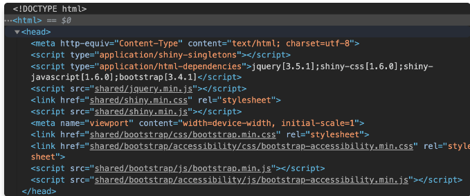

# Discover Shiny dependencies

**Learning objectives:**

- These chapter will help us to understand shiny dependencies in R.

## Introduction

- Shiny creates HTML code for us, it is not enough to design a beautiful working app with user interactions.

-  All modern websites and apps have a lot of CSS and JavaScript under the hood.

```{r,eval=FALSE}
library(shiny)
ui <- fluidPage(
  p("Hello World")
)

server <- function(input, output) {
  
}
shinyApp(ui, server)
```




According to the head section, Shiny has three main dependencies:

- jQuery.

- shiny (custom JavaScript and CSS).

- Bootstrap (JavaScript and CSS).

## Bootstrap

- Bootstrap provides plug and play layout and interactive elements, such as tabs, navigation bars, tooltips, popovers to customize our shiny app.

- One of the great advantage of using Bootstrap is the responsiveness of the design that can work either on desktop or mobile.

- The code that summarizes Shiny Bootstrap-based layout elements, such as the well-known fluidPage() wrapper can be found [here](https://github.com/rstudio/shiny/blob/60db1e02b03d8e6fb146c9bb1bbfbce269231add/R/bootstrap-layout.R).

## jQuery, DOM manipulation

- [jQuery](https://jquery.com/) allows JavaScript developers to perform DOM manipulation, that is, interacting with HMTL elements, in a more user-friendly manner than with pure JavaScript.

```{js}
// select the button
var btn = document.getElementById('mybutton');
// event
btn.addEventListener('click', function() {
  alert('You clicked me!'); // action
});
```

```{jq}
$('#mybutton').on('click', function() {
  alert('You clicked me!');
});
```

## Custom dependencies

The last dependency contains custom JS and CSS code necessary for Shiny to work, that is:

- Fine-tune the layout.

- Register input/output and handle every single input/output action.

- Detailed mechanisms are studied in Chapters [12](https://unleash-shiny.rinterface.com/shiny-input-system.html#shiny-input-system) and [13](https://unleash-shiny.rinterface.com/shiny-input-lifecycle.html#shiny-input-lifecycle).

- Initialize and control the R/JS communication, as shown in Chapter [11.3.1](https://unleash-shiny.rinterface.com/shiny-intro.html#from-R-to-JS).

- Handle alerts/modals/notifications.

- Chapters [10.6.3](https://unleash-shiny.rinterface.com/survival-kit-javascript.html#shiny-js-object), [12](https://unleash-shiny.rinterface.com/shiny-input-system.html#shiny-input-system), [15](https://unleash-shiny.rinterface.com/shiny-custom-handler.html#shiny-custom-handler) and [19](https://unleash-shiny.rinterface.com/custom-templates-interactivity.html#custom-templates-interactivity) showcase the most important elements of those custom files.

## Exercise

In the following exercise, we consider a slightly more complex app with a slider as well as a plot output.

- Run the app runExample("01_hello").

- Open the HTML inspector.

- Delete the bootstrap.min.css and ion.rangeSlider.css dependencies by removing the corresponding DOM element.
What happened to the application’s UI?


## Conclusion

To sum up, shiny dependencies are necessary to make Shiny what it is! Importantly, Shiny only loads what is necessary to have. For instance, as shown above, it is only necessary to include the slider dependencies when there is at least one slider in the app, which eventually improves app performances.


## Meeting Videos

### Cohort 1

`r knitr::include_url("https://www.youtube.com/embed/URL")`

<details>
<summary> Meeting chat log </summary>

```
LOG
```
</details>
