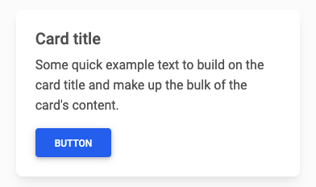
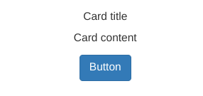
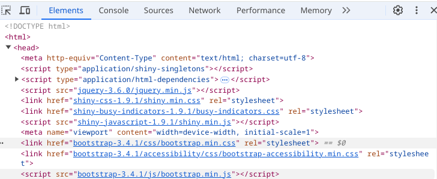
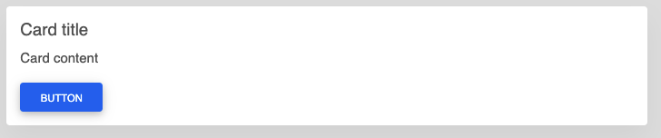
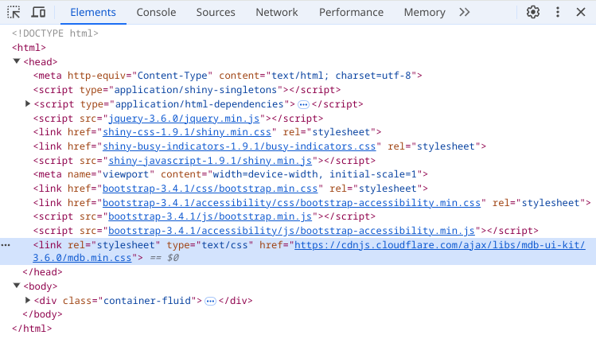
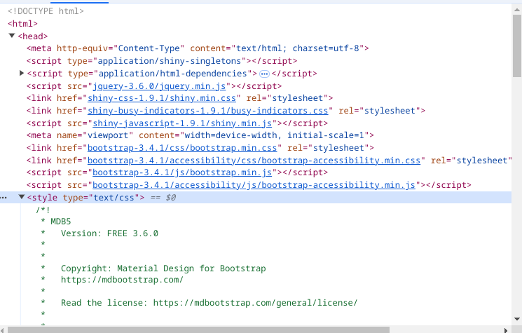
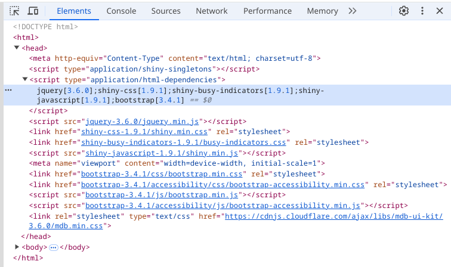
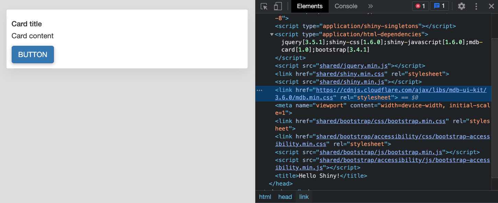
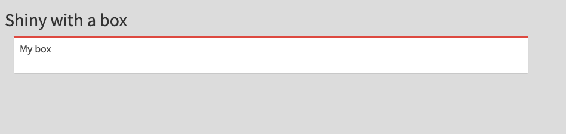

# Handle HTML dependencies with htmltools

**Learning objectives:**

* How we can utilize {htmltools} manage web dependencies (CSS and JS).
* Familiarize ourselves on how to use the  `htmlDependency()` &  `tagList()` to properly handle web dependencies in Shiny apps
* Learn about the `findDependencies()`, `suppressDependencies()` and `resolveDependencies()` functions and understand when and why they are necessary in Shiny app development.

<br>

> This opens the doors to work with almost **any web framework**


## Finding a card {-}

We saw this card on __Material Design for Bootstrap (MDB)__ [documentation](https://mdbootstrap.com/docs/standard/components/cards/).



```html
<div class="card">
  <div class="card-body">
    <h5 class="card-title">Card title</h5>
    <p class="card-text">Some quick example text to build on the card title and make up the bulk of the card's content.</p>
    <button type="button" class="btn btn-primary" data-mdb-ripple-init>Button</button>
  </div>
</div>
```

## Wrapping html into a function {-}

```html
<div class="card">
  <div class="card-body">
    <h5 class="card-title">Card title</h5>
    <p class="card-text">Some quick example text to build on the card title and make up the bulk of the card's content.</p>
    <button type="button" class="btn btn-primary" data-mdb-ripple-init>Button</button>
  </div>
</div>
```

```{r}
library(shiny)

my_card <- function(...) {
  withTags(
    div(
      class = "card",
      div(
        class = "card-body",
        h5(class = "card-title", "Card title"),
        p(class = "card-text", "Card content"),
        button(
          type = "button",
          class = "btn btn-primary",
          "Button"
        )
      )
    )
  )
}
```

## Checking the result {-}





## Finding dependencies {-}

We need to import the _Material Design for Bootstrap_ dependency, to make that we have 2 alternatives:

- Defining the needed styles in local file in the `www/`.
- Use a content delivery network (CDN) like [cdnjs](https://cdnjs.com/), where we can find [mdb-ui-kit](https://cdnjs.com/libraries/mdb-ui-kit).

```r
mdb_cdn <- "https://cdnjs.cloudflare.com/ajax/libs/"
mdb_css <- paste0(mdb_cdn, "mdb-ui-kit/3.6.0/mdb.min.css")
```

##  Adding a link on the head tag {-}



```r
fluidPage(
  tags$head(
    tags$link(
      rel = "stylesheet",
      type = "text/css",
      href = mdb_css
    )
  )
)

```



##  `includeCSS()` on the head tag {-}


```r 
fluidPage(
  tags$head(
    includeCSS(path = mdb_css)
  )
)
```



## Using `htmlDependency()` {-}

It has the advantage of adding the dependency in the header with its __name__ and __version__.



## Using `htmlDependency()` {-}

Main parameters:

- A __name__.
- A __version__ (useful to remember on which version it is built upon).
- A __path__ to the dependency (can be a CDN or a local folder).
- __script__ and __stylesheet__ to respectively pass css and scripts.

```r
# handle dependency
mdb_cdn <- "https://cdnjs.cloudflare.com/ajax/libs/"
mdb_card_dep <- function() {
  htmlDependency(
    name = "mdb-card",
    version = "1.0",
    src = c(href = mdb_cdn),
    stylesheet = "mdb-ui-kit/3.6.0/mdb.min.css"
  )
}
```

> It is __crucial to wrap the created dependency in a function__ since the path has to be determined at __run time__ and not when the package builds.

## Using `htmlDependency()` {-}

Then we just need to the created element and the dependency into  `tagList()` function.

```r
my_card_with_deps <- function(...) {
  
  cardTag <- my_card(...)

  tagList(cardTag, mdb_card_dep())

}
```

> __Now we can share our element in a package__.

## `htmlDependency()` disanvantage {-}

The dependency was added but in the **wrong place** (before bootstrap).



## Extracting web dependencies {-}

__box tag__ won't work since __shiny__ does not have __shinydashboard__ dependencies

`htmltools::findDependencies()` that looks for all dependencies attached to a tag. 


```{r, message=FALSE}
library(shinydashboard)
dashboard_ui <- dashboardPage(
  dashboardHeader(),
  dashboardSidebar(),
  dashboardBody()
)

library(htmltools)
dashboard_deps <- findDependencies(dashboard_ui)

sapply(dashboard_deps, \(x) paste0(x$name, ": ", x$version))
```

## font-awesome {-}

It handles icons.

```{r message=TRUE}
print(dashboard_deps[[2]])
```

## Using extracted web dependencies {-}

Now we can add the dependencies with the element to we want to use but using the `fluidPage()` function.

```r
my_dashboard_box <- function(title, status) {
  tagList(
    box(title = title, status = status), 
    dashboard_deps
  )
}

library(shiny)
library(shinydashboard)

ui <- fluidPage(
  tags$style("body { background-color: gainsboro; }"),
  titlePanel("Shiny with a box"),
  my_dashboard_box(title = "My box", status = "danger"),
)
server <- function(input, output) {}
shinyApp(ui, server)
```



## Suppress Dependencies {-}

If we have a conflict we can use `suppressDependencies()` as an element of the __body tag__.


## Removing AdminLTE {-}

```r
library(shiny)
library(shinydashboard)

shinyApp(
  ui = dashboardPage(
    dashboardHeader(),
    dashboardSidebar(),
    dashboardBody(suppressDependencies("AdminLTE")),
    title = "Dashboard example"
  ),
  server = function(input, output) { }
)
```

## Removing redundant dependencies {-}

If want to update the **last version** of Font Awesome icons (from 5.15.1 to 6.4.2)


```{r}
jsdelivr_cdn <- "https://cdn.jsdelivr.net/npm/@fortawesome/"
ft_aws <- paste0(jsdelivr_cdn, "fontawesome-free@5.15.1/")
new_icon_dep <- htmlDependency(
  name = "font-awesome",
  version = "5.15.1",
  src = c(href = ft_aws),
  stylesheet = "css/all.min.css"
)

icon_deps <- list(
  new_icon_dep,
  findDependencies(shiny::icon("th"))[[1]]
)

resolveDependencies(icon_deps)
```

## Insert custom script in the head {-}

To embed dynamic user scripts in a dependency.

```{r}
options <- list(
  sidebarExpandOnHover = TRUE,
  boxWidgetSelectors = list(
    remove = '[data-widget="remove"]'
  )
)

config_script <- function(options) {
  htmlDependency(
    "options",
    as.character(utils::packageVersion("shinydashboardPlus")),
    src = c(file = system.file(
      "shinydashboardPlus-2.0.0",
      package = "shinydashboardPlus")
    ),
    head = if (!is.null(options)) {
      paste0(
        "<script>var AdminLTEOptions = ",
        jsonlite::toJSON(
          options,
          auto_unbox = TRUE,
          pretty = TRUE
        ),
        ";</script>"
      )
    }
  )
}

# show the script
print(HTML(config_script(options)$head))
```


## Meeting Videos

### Cohort 1

`r knitr::include_url("https://www.youtube.com/embed/BdQMvsIN6Pg")`

<details>
<summary> Meeting chat log </summary>

```
00:02:21	Russ:	Hi everyone
00:17:23	Russ:	TODO: Why is tags$head for a local stylesheet potentially bad when working with other developers
00:24:57	Russ:	TODO: What is the benefit of htmlDependency for an external html dependency
```
</details>
