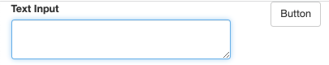
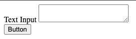
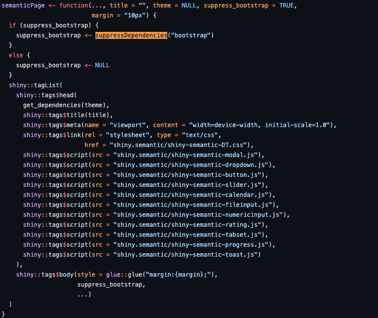

# Handle HTML dependencies with htmltools

**Learning objectives:**

* Familiarise ourselves on how to use the  `htmlDependency()` &  `attachDependencies()` to properly handle web dependencies in Shiny apps
* Learn about the `findDependencies()`, `suppressDependencies()` and `resolveDependencies()` functions and understand when and why they are necessary in Shiny app development


## Intro & Recap

In the last meeting we looked at what Shiny's dependencies are:

* jQuery
* shiny (custom JavaScript and CSS)
* Bootstrap (JavaScript and CSS).

This week we'll look at how to manage arbitrary dependencies and resolve conflicts. 

But first, why would we want to do this?

## Motivation

Shiny's dependencies do a lot of work for us, for example if we generate a basic UI in shiny with R code:

```{r, eval = FALSE}
ui <- shiny::fluidPage(
  shiny::fluidRow(
    shiny::column(width = 2, shiny::textAreaInput("x", "Text Input")),
    shiny::column(width = 1, shiny::actionButton("y", "Button"))
  )
)
server <- function(input, output, session){
}
shiny::shinyApp(ui, server)
```





But what if we didn't want the help from Shiny, or we wanted to pick and choose the help we get. For example, we might not want the light blue glow around the text input box when it's clicked. We might want a different colour, or no glow at all.

How do we do this?

## Strategies for adding custom styling to Shiny apps:

Let's say we wanted to edit the button's appearance to be green, say 'click me' and change colour when clicked.

Approach 1 is to use inline HTML/CSS

```{r, eval = FALSE}
library(shiny)

ui <- fluidPage(
  tags$head(
    tags$style(HTML("
      /* Button style */
      .my-btn {
        background-color: #4CAF50; /* Green background */
        border: none; /* Remove border */
        color: white; /* White text */
        padding: 12px 24px; /* Some padding */
        text-align: center; /* Center text */
        text-decoration: none; /* Remove underline */
        display: inline-block; /* Make it an inline element */
        font-size: 16px; /* Increase font size */
        cursor: pointer; /* Add cursor on hover */
        border-radius: 5px; /* Add rounded corners */
      }
      
      /* Button hover style */
      .my-btn:hover {
        background-color: #3e8e41; /* Dark green background on hover */
      }
    "))
  ),
  
  # Button with custom class
  actionButton(inputId = "my-btn", label = "Click me!", class = "my-btn")
)

server <- function(input, output) {
  # Do something when button is clicked
}

shinyApp(ui, server)
```


However, this is considered an anti-pattern.

## Why is in-line CSS an anti-pattern

Although this list is surely not comprehensive (jump in and add new examples if/when you please!)

* Our UI is rapidly going to grow and be hard to keep track of

* We're mixing HTML, CSS and R code in the same document.

* We'll end up repeating ourselves, a lot (DRY).

* It's difficult for us to maintain (and we wrote it ) it's even harder for collaborators to join us in development.

## So what should we do?

Point to an external styles sheet, which re-styles elements from a central location, thus being easier to maintain and understand, and reducing bloat in our app's ui logic.

We have three main choices:

the `includeCSS()` function

or following web development best practices:

`tags$head(tags$link(rel = "stylesheet", type = "text/css", href = "custom.css"))`

The href could link to a Content Delivery Network, or a local css file, usually saved in www/

'However, not easy to share this with over developers since there is no way to recover the specific dependency' 

* Anyone able to jump in and go further on this - RE: recovering the specific dependency?

* Any thoughts on this, I've personally been using the external styles sheet similar to the 'custom.css' approach here and thought it was the right thing to do, so this is interesting and new!

The recommended approach is to use the `htmlDepedency()` and `attachDepdencies()`

## Use htmltools

The recommended approach is to use the `htmlDepedency()` and `attachDepdencies()`

* A *name.*
* A *version* (useful to remember on which version it is built upon).
* A *path* to the dependency (can be a CDN or a local folder). 
* *script and stylesheet* to respectively pass css and scripts

An example from the book:
```{r, eval = FALSE}
# handle dependency
mdb_cdn <- "https://cdnjs.cloudflare.com/ajax/libs/"
mdb_card_dep <- function() {
  htmlDependency(
    name = "mdb-card",
    version = "1.0",
    src = c(href = mdb_cdn),
    stylesheet = "mdb-ui-kit/3.6.0/mdb.min.css"
  )
}
```

Note, that if not using a CDN and using local files, crucial to wrap the newly created dependency in a function, since the path has to be determined *at run time* and *not when the package builds*.

I won't include the my_card full code as we'd bloat the slides up quite a bit, see the book for the full example and code to run.

However, the story is not complete, because we haven't guaranteed that the styling we have just added takes precedence over Shiny's existing dependencies. 

The order of execution is important here. If our styling is executed before a conflicting stylesheet, our styling will be overridden. As the book states:

"Under the hood, Shiny adds many necessary dependencies like Bootstrap and jQuery, and you have no control over where your own dependencies will be inserted..."

## Import additional HTML dependencies

Let's say we were used to using {shinydashboard} and we want to implement a box component *without* the dashboard layout. If we don't specifically include the requisite dependency from {shinydashboard}, nothing will displace because shiny does not natively have a dependency on {shinydashboard}.

We can use {htmltools} and the `findDependencies()` function.
The function looks for all dependencies attached to a tag.

```{r, message=FALSE}
library(shinydashboard)
library(htmltools)
dashboard_ui <- dashboardPage(
  dashboardHeader(),
  dashboardSidebar(),
  dashboardBody()
)

dashboard_deps <- findDependencies(dashboard_ui)
dashboard_deps[[1]]
```

There are 3 other dependencies trimmed for space (see book!)

We can attach the depedencies to our own dashboard-box-generating funtion:
```{r, eval = FALSE}
my_dashboard_box <- function(title, status) {
  tagList(
    box(title = title, status = status), 
    dashboard_deps
  )
}
```

and then we could call it in a dummy app like follows:
```{r, eval = FALSE}
library(shiny)
library(OSUICode)

ui <- fluidPage(
  tags$style("body { background-color: gainsboro; }"),
  titlePanel("Shiny with a box"),
  my_dashboard_box(title = "My box", status = "danger"),
)
server <- function(input, output) {}
shinyApp(ui, server)
```

## Suppress Dependencies

Let's say we have a conflict and we can't run one of our packages as well as bootstrap - we'd need to remove the bootstrap dependency that ships with Shiny.

How?

using the `suppressDependencies()` function from {htmtools} of course! But first, we need to know which dependencies to remove.



Book example of removing the AdminLTE dependency from shinydashboard:

```{r, eval = FALSE}
library(shiny)
library(shinydashboard)

shinyApp(
  ui = dashboardPage(
    dashboardHeader(),
    dashboardSidebar(),
    dashboardBody(suppressDependencies("AdminLTE")),
    title = "Dashboard example"
  ),
  server = function(input, output) { }
)
```

## Resolve Dependencies

Imagine a situation in which we would like to use the very last version of Font Awesome icons, which is currently 5.15.1 according to jsdelivr. We recall that shiny already provides version 5.13.0 through the icon() function. Including another version would probably cause conflicts, and we would like to avoid that case. {htmltools} has a `resolveDependencies()` tool that removes any redundant dependencies, keeping the dependency with the higher version if names are identical:

```{r}
jsdelivr_cdn <- "https://cdn.jsdelivr.net/npm/@fortawesome/"
ft_aws <- paste0(jsdelivr_cdn, "fontawesome-free@5.15.1/")
new_icon_dep <- htmlDependency(
  name = "font-awesome",
  version = "5.15.1",
  src = c(href = ft_aws),
  stylesheet = "css/all.min.css"
)

icon_deps <- list(
  new_icon_dep,
  findDependencies(shiny::icon("th"))[[1]]
)

resolveDependencies(icon_deps)
```


## Meeting Videos

### Cohort 1

`r knitr::include_url("https://www.youtube.com/embed/URL")`

<details>
<summary> Meeting chat log </summary>

```
LOG
```
</details>
