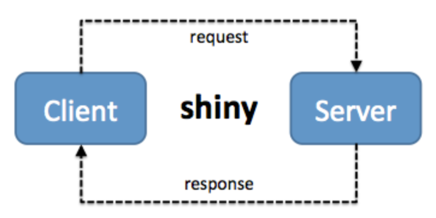
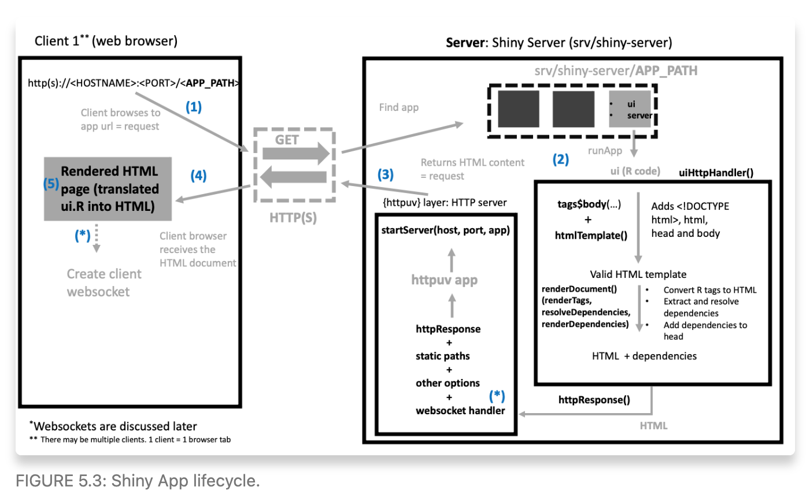

# Web application concepts

**Learning objectives:**

Underlying web applications for Shiny integration

-   client-server model
-   the HTTP protocol
-   web servers

## The client-server model

The model interaction between:

-   client
-   server
-   network

<center>

```{r flowchart, echo = F, fig.cap = "client-server model"}
library(DiagrammeR)
DiagrammeR::mermaid(
  "graph LR
  A(client)---B(server)
  A-->C(network)
  C-->B
  ", height = '100%', width = '100%'
)
```
 
</center> 

### HyperText Transfer Protocol (HTTP)
```{r}
library(shiny)
```

```{r eval=FALSE}
ui <- fluidPage()
server <- function(input, output, session) {}
shinyApp(ui, server)
```
 
If we have a look at the developer settings in the browser page, under the **network** tab ---> 

We see many files (reload) for all requests.

<center>

</center>
 
To improve the speed, as all requests are from a server, let's have a look at the **HTTP requests**.
 
 
## About HTTP requests

These are the **intentions** steps. The HTTP protocol is **unidirectional** just as the same as a phone call.

<center>

```{r flowchart2, echo = F, fig.cap = "GET-->POST"}
library(DiagrammeR)
DiagrammeR::mermaid(
  "graph LR
  A(GET<br>ask)-->B(POST<br>submit)
  ", height = '100%', width = '100%'
)
```

</center>

```{r}
library(httr)
res <- GET("https://www.google.com")
res
```


## Structure of an URL

More resources here: [https://developer.mozilla.org/en-US/docs/Learn/Common_questions/Web_mechanics/What_is_a_URL](https://developer.mozilla.org/en-US/docs/Learn/Common_questions/Web_mechanics/What_is_a_URL)

### Web app files structure

A **Shiny app** is different! The `index.html` is created on the fly.

Basic App folder:

- `app.R` or `ui.R/server.R`
- A `www` folder containing assets like JS, CSS, images.

## Serving web apps

- Shiny server open source: [https://rstudio.com/products/shiny/download-server/](https://rstudio.com/products/shiny/download-server/).
- Shiny server pro.
- RStudio Connect / Quarto Connect
- shinyapps.io

## About {httpuv}

This is a package `{httpuv}` that relies with your shiny app server. It provides a dedicated server for your app.

> it fires a web server for each app directly from R

```{r eval=FALSE}
app <- list()
app$call <- function(req) {
  list(
    status = 200L,
    headers = list(
      'Content-Type' = 'text/html'
    ),
    body = html
  )
}
```

```{r eval=FALSE}
library(httpuv)
s <- startServer(
  "127.0.0.1",
  8080,
  app
)
```

## Shiny app lifecycle



### Building the UI

```{r eval=FALSE}
ui <- fluidPage(
  textInput("caption", "Caption", "Data Summary"),
  verbatimTextOutput("value")
)

ui <- htmlTemplate(
  system.file("template", "default.html", package = "shiny"), 
  lang = "en", 
  body = tags$body(ui), 
  document_ = TRUE
)
```


## Meeting Videos

### Cohort 1

`r knitr::include_url("https://www.youtube.com/embed/URL")`

<details>

<summary>Meeting chat log</summary>

    LOG

</details>
