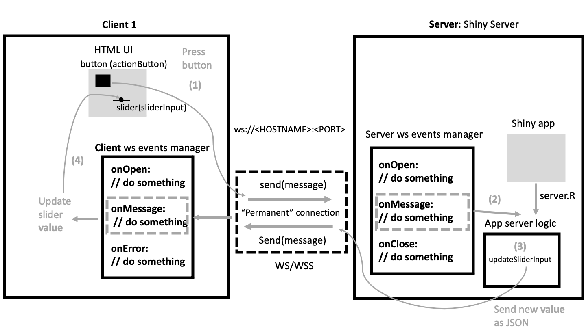
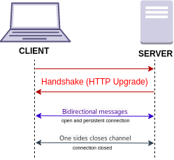
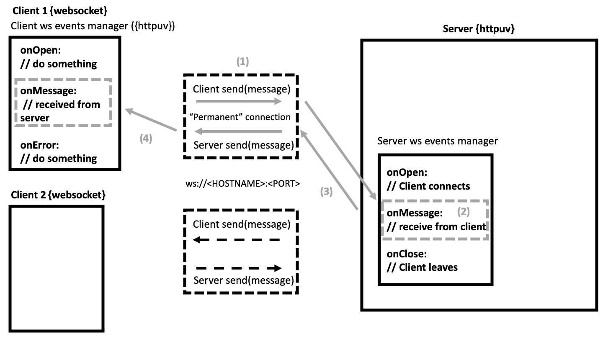
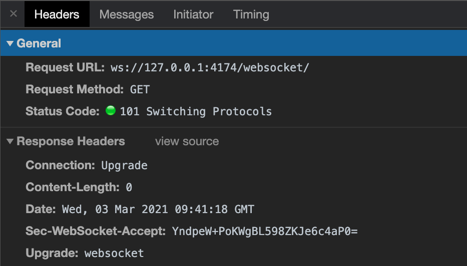

# Communicate between R and JS

**Learning objectives:**

- Explain the main mechanisms behind a Shiny app responsible for driving the __R/JavaScript communication__.

- This is crucial if you aim at developing your very own __Shiny input widgets__.

<br>

**HTTP Limitation**

- The __connection is closed__ after each request.
- We need a __permanent connection__, allowing bidirectional fluxes between __R__ and __JS__

## Introductory example {-}

The Shiny app:

- `actionButton()` _(**sends a message** from the client (JS) to the server (R))_

    - Triggers an `observeEvent()` _(**processes message** and updates the R server)_
        - Fires `updateSlideInput()`_(**sends a message back** to the client containing the id of the input to update)_


- `sliderInput()` 

    - _(JS **receives the message** and updates the corresponding input element)_
    - _(JS **sends the new input value** to the server)_

{width=80%}

## How R and JS communicate? {-}

**JSON** stands for JavaScript Object Notation. 

- It has the same structure as a **JS object**.

- It can be serialized as a character string.

```json
{
  "name": "David",
  "color": "purple",
  "planet": "Mars",
  "animals": [
    {
      "name": "Euclide",
      "type": "cat",
      "age": 7
    }
  ]
}
```

```{r}
#| echo: false

my_json <- '
{
  "name": "David",
  "color": "purple",
  "planet": "Mars",
  "animals": [
    {
      "name": "Euclide",
      "type": "cat",
      "age": 7
    }
  ]
}
'
```


## Read JSON in R {-}

Read data from a JSON and convert it to the appropriate R structure.

```{r}
library(jsonlite)
res <- fromJSON(my_json)
str(res)
```


## Read JSON in R {-}

If you don't want to get a data.frame we can run.

```{r}
fromJSON(my_json, simplifyVector = FALSE)
```

## Export JSON from R {-}

```{r}
my_list <- list(
  name = "David",
  color = "purple",
  planet = "Mars"
)

toJSON(my_list)
```


## Export JSON from R {-}

If you want to have have different view:

- `auto_unbox`: automatically unbox() all atomic vectors of length 1.
- `pretty`: adds indentation whitespace to JSON output. 

```{r}
my_list <- list(
  id = "01522",
  name = "David",
  organization = list(
    id = "AWER12",
    name = "RinteRface",
    site = "Switzerland"
  )
)

toJSON(my_list, auto_unbox = TRUE, pretty = TRUE)
```

## Read and Export JSON in JS {-}

Read JSON

```javascript
JSON.parse(my_json)
```

Export JSON

```javascript
myObject = {
  "name": "David",
  "color": "purple",
  "planet": "Mars",
}
JSON.stringify(my_object)
```

## What is a websocket? {-}

> It is a computer **communications protocol**, providing a simultaneous two-way communication channel over a single Transmission Control Protocol (TCP) connection.

<br>

<p align="center">

<p>

## Creating a server {-}

`httpuv::startServer:` Creates an HTTP/WebSocket server on the specified host and port.

```{r}
#| file: examples/chapter-11/01-server-example.R
```


## Creating a client {-}

```{r}
#| eval: false

# set the client
ws <- websocket::WebSocket$new("ws://127.0.0.1:8080/")

ws$onMessage(function(event) {
  cat("Client received message:", event$data, "\n")
})

# Wait for a moment before running next line
ws$send("Hello server!")

# Close client
ws$close()
```

## Websocket diagram {-}




## Starting connection {-}

To initiate a websocket connection:

- The client sends an HTTP request to the server _(known as **handshake**)_
- If the server accepts, the returned HTTP code is 101, meaning that we __switch protocole from HTTP to WS__ or WSS



## JS to R websocket {-}


## Meeting Videos {-}

### Cohort 1

`r knitr::include_url("https://www.youtube.com/embed/9dTKN04Hli0")`

<details>
<summary> Meeting chat log </summary>

```
00:03:23	Russ:	Hi
00:08:26	Russ:	start
00:08:31	Trevin Flickinger:	Reacted to "start" with 👍
01:00:08	Russ:	https://shiny.rstudio.com/py/docs/deploy.html#:~:text=Shiny%20uses%20WebSockets%20for%20most,networks%20interfere%20with%20WebSocket%20traffic.
01:01:06	Arthur Shaw:	Gotta hop to another meeting. Thanks for the great presentation, Russ!
01:01:53	Oluwafemi Oyedele:	Thank you very much!!!
01:02:51	Trevin Flickinger:	Thanks Russ
01:02:53	Russ:	end
01:02:58	Russ:	See youy later everyone
```
</details>
