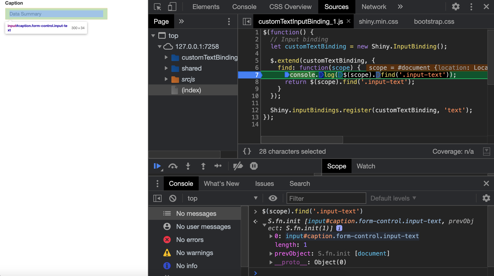
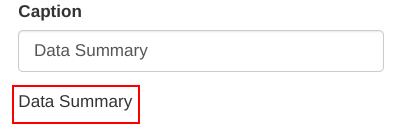
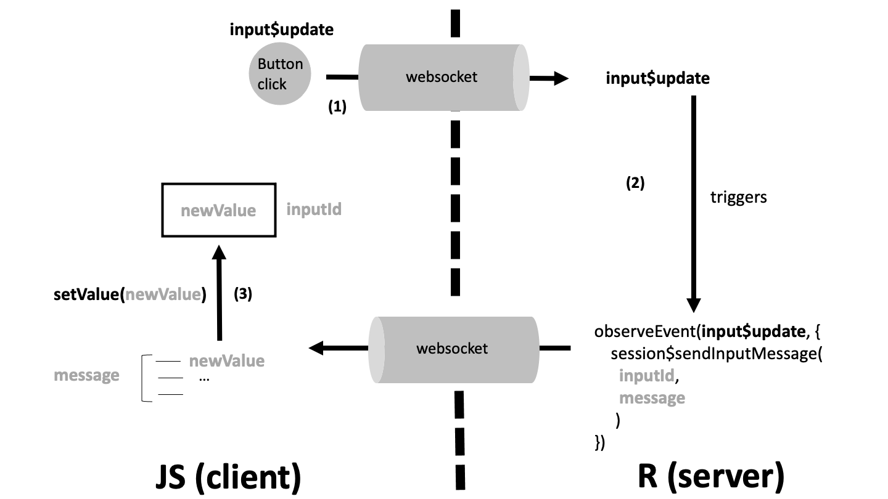
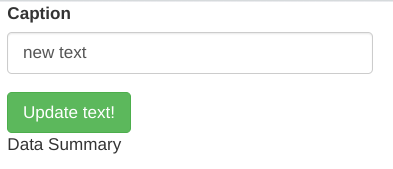

# Understand and develop new Shiny inputs

**Learning objectives:**

- Understand how Shiny inputs work
- Understand how to create new Shiny inputs.

## Input bindings {-}

- Upon initialization, Shiny runs several **JavaScript functions**.
- Some of those functions are **exposed through the Shiny JS object**.

Let's see an example:

1. Run the below app.

```{r}
#| eval: false

OSUICode::run_example(
 "input-system/dummy-app",
  package = "OSUICode"
)
```

2. Open the HTML inspector and the console you run `Shiny.unbindAll(document);`

3. The plot will stop changing regardless how much you the slicer.

4. Run `Shiny.bindAll(document);` to take the app back to normality.


## Adding JS to UI {-}

As `onclick` is a valid HTML attribute for the &lt;button&gt; tag, we can use it within Shiny's actionButton to __execute arbitrary JavaScript code__ when the button is clicked.


> `onclick` is supported for __all HTML elements__, EXCEPT: &lt;base&gt;, &lt;bdo&gt;, &lt;br&gt;, &lt;head&gt;, &lt;html&gt;, &lt;iframe&gt;, &lt;meta&gt;, &lt;param&gt;, &lt;script&gt;, &lt;style&gt;, and &lt;title&gt;


```{r}
#| eval: false

library(shiny)

ui <- fluidPage(
  actionButton(
    "unbind",
    "Unbind inputs",
    onclick = "Shiny.unbindAll();"
  ),
  actionButton(
    "bind",
    "Bind inputs",
    onclick = "Shiny.bindAll(document);"
  ),
  lapply(1:3, function(i) {
    textInput(paste0("text_", i), paste("Text", i))
  }),
  lapply(1:3, function(i) {
    uiOutput(paste0("val_", i))
  })
)

server <- function(input, output, session) {
  lapply(1:3, function(i) {
    output[[paste0("val_", i)]] <- renderPrint({
      input[[paste0("text_", i)]]
    })
  })
}

shinyApp(ui, server)
```

## Input structure {-}

- **id** guarantees the input uniqueness

- **type** defines how the element is displayed in several ways.

| Type | Type | Type | Type | Type |
|------|------|------|------|------|
| button | checkbox | color | date | datetime-local |
| email | file | hidden | image | month |
| number | password | radio | range | reset |
| search | submit | tel | text | time |
| url | week | | | |

- **class** may be required to find the element in the DOM. 

- **value** holds the input value.

```html
<input id = "id" type = "text" class = "..." value = value>
```

## Binding Shiny inputs {-}

The `InputBinding` methods are the set of instructions **you need to provide to Shiny** so it understands **how to interact with your custom HTML** input component by defining:

1.  **How to find** your input elements in the HTML.
2.  **How to get a unique ID** for each input instance.
3.  **What type of data** it represents.
4.  **How to extract the value** from your custom input.
5.  **How to detect when the value changes** and notify Shiny.
6.  **How to update your input** from the server.
7.  **How to manage communication frequency** for efficiency.
8.  **How to set up and clean up** your input element's resources.

> It relies on a class defined in the [`input_binding.js`](https://github.com/rstudio/shiny/blob/60db1e02b03d8e6fb146c9bb1bbfbce269231add/srcjs/input_binding.js)

## Binding Shiny inputs {-}

| Method Name           | Utility for Custom Inputs                                 | Description                                                                                                                                                                                                                                          |
|-----------------------|-----------------------------------------------------------|------------------------------------------------------------------------------------------------------------------------------------------------------------------------------------------------------------------------------------------------------|
| `find(scope)`         | **Element discovery**                                     | Defines how Shiny.js locates HTML elements within a given scope (e.g., a div) to treat as instances of your custom input. This method must be implemented for proper element selection.                                                         |
| `getId(el)`           | **Unique ID extraction**                                  | Retrieves a unique identifier for the input element—using `data-input-id` or the element’s `id`—to correctly link the client-side input with the corresponding Shiny server object.                                                           |
| `getType()`           | **Data type specification**                               | Returns the type of the input (e.g., "numeric", "character") so that the server can properly deserialize JSON data. If not specified, it defaults to a general type.                                                                           |

## Binding Shiny inputs {-}

| Method Name           | Utility for Custom Inputs                                 | Description                                                                                                                                                                                                                                          |
|-----------------------|-----------------------------------------------------------|------------------------------------------------------------------------------------------------------------------------------------------------------------------------------------------------------------------------------------------------------|
| `getValue(el)`        | **Value extraction**                                      | Core method for extracting the current value from the input element. It must be implemented to read the appropriate property or attribute reflecting the user’s input.                                                                          |
| `subscribe(el, callback)` | **Reactivity and event handling**                     | Sets up event listeners (e.g., on 'change', 'keyup', or 'click') so that any input change triggers the provided callback. This keeps Shiny aware of real-time changes in your custom component.                                                |
| `unsubscribe(el)`     | **Resource cleanup**                                      | Removes event listeners attached in `subscribe`, ensuring efficient resource management and preventing memory leaks when the input is removed from the DOM.                                                                                         |


## Binding Shiny inputs {-}

| Method Name           | Utility for Custom Inputs                                 | Description                                                                                                                                                                                                                                          |
|-----------------------|-----------------------------------------------------------|------------------------------------------------------------------------------------------------------------------------------------------------------------------------------------------------------------------------------------------------------|
| `receiveMessage(el, data)` | **Server-controlled updates**                        | Allows the Shiny server to update the input element by sending new data (like value, min, or max) and triggers a change event. This method must be implemented to support dynamic updates from R.                                             |
| `getState(el)`        | **Comprehensive state capture**                           | Captures the complete state of the input (beyond just its value), which is useful for complex inputs with multiple properties. This state can then be communicated back to the server for restoration or analysis.                             |
| `getRatePolicy()`     | **Efficient server communication**                        | Specifies the rate at which input updates are sent to the server (using strategies like debounce or throttle). Defaults to `null` if not defined, but can be customized to optimize performance during rapid input changes.                     |


## Binding Shiny inputs {-}

| Method Name           | Utility for Custom Inputs                                 | Description                                                                                                                                                                                                                                          |
|-----------------------|-----------------------------------------------------------|------------------------------------------------------------------------------------------------------------------------------------------------------------------------------------------------------------------------------------------------------|
| `initialize(el)`      | **Initial setup**                                         | Invoked when the input element is first rendered or dynamically added, allowing for any required pre-binding initialization—such as configuring JavaScript widgets or setting initial states.                                                     |
| `dispose(el)`         | **Teardown and cleanup**                                  | Called when an input element is removed, this method cleans up event listeners and any other resources to prevent memory leaks and maintain application efficiency.                                                                                |

## Re-create textInput {-}

1. Define where to store the binding JS methods to use.

```{r}
#| eval: false

customTextInputDeps <- function(binding_step) {
  htmlDependency(
    name = "customTextBindings",
    version = "1.0.0",
    src = c(file = system.file(
      "input-system/input-bindings", 
      package = "OSUICode"
    )),
    script = paste0(
      "customTextInputBinding_", 
      binding_step, 
      ".js"
    )
  )
}
```

## Re-create textInput {-}

2. Create an UI function with the new class `input-text` and JS dependency.

> The original `textInput()` use the binding based on input type.

```{r}
#| eval: false

customTextInput <- function (
  inputId, 
  label, 
  value = "", 
  width = NULL, 
  placeholder = NULL,
  binding_step
) {
  
  # this external wrapper ensure to control the input width
  div(
    class = "form-group shiny-input-container", 
    style = if (!is.null(width)) {
      paste0("width: ", validateCssUnit(width), ";")
    },
    # input label
    shinyInputLabel(inputId, label), 
    
    # input element + JS dependencies
    tagList(
      customTextInputDeps(binding_step),
      tags$input(
        id = inputId,
        type = "text",
        class = "form-control input-text",
        value = value,
        placeholder = placeholder
      )
    )
  )
}
```


## Re-create textInput {-}

3. Write the JS binding methods as you can see below for the [find](https://github.com/DivadNojnarg/OSUICode/blob/master/inst/input-system/input-bindings/customTextInputBinding_1.js) method.

```javascript
$(function() {
  // Input binding
  let customTextBinding = new Shiny.InputBinding();

  $.extend(customTextBinding, {
    find: function(scope) {
      console.log($(scope).find('.input-text'));
      return $(scope).find('.input-text');
    }
  });

  Shiny.inputBindings.register(customTextBinding, 'text');
});
```


## Re-create textInput {-}

Now we can wrap the input in simple app to see if the method is working in the inspector console.

```{r}
#| eval: false

library(shiny)
library(OSUICode)

customTextInputExample <- function(binding_step) {
  ui <- fluidPage(
    customTextInput(
      inputId = "caption",
      label = "Caption",
      value = "Data Summary",
      binding_step = binding_step
    ),
    textOutput("custom_text")
  )
  server <- function(input, output) {
    output$custom_text <- renderText(input$caption)
  }
  shinyApp(ui, server)
}
```


## Debbuging JS methods {-}

1. Run the app.

```{r}
#| eval: false

OSUICode::customTextInputExample(1)
```

2. Open the developer tools
3. On the sources tab, look for the `customTextInputBinding.js` script 
4. Put a breakpoints in the `find` method 
5. Reload the page
6. Type the console `$(scope).find('.input-text')` to display the DOM element

> If hover over the JavaScript output, the element will be highlighted.



## Initialize inputs {-}

Upon initialization:

1. Shiny calls the `initializeInputs` function.
2. It takes **all input bindings** and **calls their initialize method** _**before binding all inputs**_.

The `initialize` method is **not always defined**

An exception is the Framework7 (used but `{shinyMobile}`) requires **instantiating all elements**.

```javascript
let f7ToggleBinding = new Shiny.InputBinding();
  $.extend(f7ToggleBinding, {
    initialize: function(el) {
      app.toggle.create({el: el});
    },
    // other methods
});
```

Where:

- `el: '.toggle'` means that we are looking at the element(s) having the `toggle` class.
- `app.toggle.create` is internal to the Framework7 API.

## Get the value {-}

The **getValue** method returns the input value _(different for almost all inputs)_ 

Where it is the example for the `textInput()`:

```javascript
getValue: function(el) {
  console.log($(el));
  return $(el).val();
}
```

Where:

- **el** refers to the element holding the id attribute and recognized by the find method.
- **val()** is extracting the `value` attribute


## Get the value {-}

If we applying this binding the can see that the app is now showing the output, but if try to update the input the **output won't update** a second time.

```{r}
#| eval: false

library(OSUICode)

customTextInputExample(2)
```



## Updating Inputs From Server {-}

1. Define the **setValue** method.

```javascript
setValue: function(el, value) {
  $(el).val(value);
}
```

2. Define the **receiveMessage** method.

```javascript
receiveMessage: function(el, data) {
  console.log(data);
  if (data.hasOwnProperty('value')) {
    this.setValue(el, data.value);
  }
  // other parameters to update...
}
```

Where:

- `el` is the DOM element.
- `value` represents the new value.
- `data` are received from R as JS object

>  It is good practice to add a `data.hasOwnProperty` check to **avoid running code if the specified property does not exist**.

## Updating Inputs From R {-}



## Session Object (REMANDER) {-}

**session** is an instance of the [ShinySession](https://github.com/rstudio/shiny/blob/60db1e02b03d8e6fb146c9bb1bbfbce269231add/R/shiny.R#L338) **R6** class:

- It's **unique** to a given user
- It contains all information about input, output and client data

<br>

Exposes methods:

- **sendInputMessage** is used to update inputs from the server.
- **sendCustomMessage** sends messages from R to JS. _If `shiny.trace = TRUE` the sent JSON is displayed_.


## Sending one value from server {-}

1. Use the `getDefaultReactiveDomain()`function to **recover the current session**.
2. Use the **sendInputMessage** is used to update inputs from the server.

```{r}
#| eval: false

updateCustomTextInput <- function(
  inputId, 
  value = NULL, 
  session = getDefaultReactiveDomain()
) {
  session$sendInputMessage(inputId, message = value)
}
```

## Sending several values from server {-}

To pass multiple elements to update:

1. We can use `shiny:::dropNulls` internal function to ensure that the list does not contain NULL elements.
2. Pass the list to the **sendInputMessage**.

```{r}
#| eval: false

updateCustomTextInput <- function(
  inputId, 
  value = NULL, 
  placeholder = NULL, 
  session = getDefaultReactiveDomain()
) {
  message <- dropNulls(
    list(
      value = value,
      placeholder = placeholder
    )
  )
  session$sendInputMessage(inputId, message)
}
```


## Triggering the update from a buttom {-}



```{r}
#| eval: false

updateCustomTextInputExample <- function(binding_step) {
  ui <- fluidPage(
    customTextInput(
      "caption",
      "Caption",
      "Data Summary",
      binding_step = binding_step
    ),
    actionButton("update", "Update text!", class = "btn-success"),
    textOutput("custom_text")
  )

  server <- function(input, output, session) {
    output$custom_text <- renderText(input$caption)
    observeEvent(input$update, {
      updateCustomTextInput("caption", value = "new text")
    })
  }
  shinyApp(ui, server)
}
```


## Use the debbuger to send your own message {-}

1. Run the shiny app.

```{r}
#| eval: false

OSUICode::updateCustomTextInputExample(3)

```


2. Open the inspector and put breakpoints in the `receiveMessage` and `setValue` methods.

3. Reload the page.

4. Change the property `value` of object `data` with `data.value = "custom message";`

5. Click on the next arrow call `setValue`.

6. If you run `$(el).val(value);` in the debugger console, the DOM will be updated instantaneously with the new text.

> Please note that after clicking the button, the output **value still does not change**.


## Updating outputs when typing {-}

**subscribe** listens to events defining Shiny to update the input value and make it available in the app.

For that purpose we need to define the **event listeners** to update the app.

1. Use event `keyup` if you want to update *after a key is released on the keyboard*.
2. Use event `input` if you want to update *after copying and pasting any text in the input field or dictating text*.
3. The **callback** parameter ensures that the new value is *captured by Shiny*.


```javascript
subscribe: function(el, callback) {
      $(el).on('keyup.customTextBinding input.customTextBinding', function(event) {
        callback(true);
      }
```

```{r}
#| eval: false

OSUICode::updateCustomTextInputExample(4)

```

> Name convention used: EVENT_LISTENER.BINDING_NAME


## Updating outputs when clicking a buttom {-}

Solve this problem we need to:

1. Extend the definition of the `subscript` method by using the `change` event *(triggers when an element is updated)*.

```javascript
  subscribe: function(el, callback) {
    $(el).on('keyup.customTextBinding input.customTextBinding', function(event) {
      console.log(event);
      callback();
    });
  
    $(el).on('change.customTextBinding', function(event) {
      callback(false);
    });
  }
```

## Updating outputs when clicking a buttom {-}

2. Trigger a `change` event to trigger the subscribe method.

```javascript
  receiveMessage: function(el, data) {
    if (data.hasOwnProperty('value')) {
      this.setValue(el, data.value);
      $(el).trigger('change');
    }
  }
```

```{r}
#| eval: false

OSUICode::updateCustomTextInputExample(5)

```

## Setting rate policies {-}

If you want to change the input value **once the keyboard is completely released** for some time.

1. Define the **debounce** policy in the `getRatePolicy` method to *limit the rate at which a function can fire*, which allows a **delay** before telling Shiny to read the new value

```javascript
getRatePolicy: function() {
  return {
    policy: 'debounce', # direct or throttle
    delay: 250
  };
},
```

## Setting rate policies {-}

2. It's also important to pass `true` to the `callback` function.

```javascript
  subscribe: function(el, callback) {
    $(el).on('keyup.customTextBinding input.textInputBinding', function(event) {
      callback(true); 
    });

    $(el).on('change.customTextBinding', function(event) {
      callback();
    });
  },
```

```{r}
#| eval: false

OSUICode::updateCustomTextInputExample(6)

```

## Register an input binding {-}

```javascript
let myBinding = new Shiny.inputBinding();
  $.extend(myBinding, {
  // methods go here
});

Shiny.inputBindings.register(
  myBinding, 
  'PACKAGE_NAME.BINDING_NAME'
);
```

> Best practice is to name it following PACKAGE_NAME.BINDING_NAME, to avoid conflicts.

## Other binding methods {-}

There are also other methods that don't need to be changed most of the time:

- **getId** returns the object `id`.

- **getType** required to handle custom data formats.


## Meeting Videos

### Cohort 1

`r knitr::include_url("https://www.youtube.com/embed/oab7Cm0iFbk")`

<details>
<summary> Meeting chat log </summary>

```
00:05:22	Russ:	Hi everyone
00:08:30	Russ:	start
00:08:40	Trevin Flickinger:	Hi 👋
00:26:37	Russ:	<3 physiology
01:07:38	Russ:	end
```
</details>
