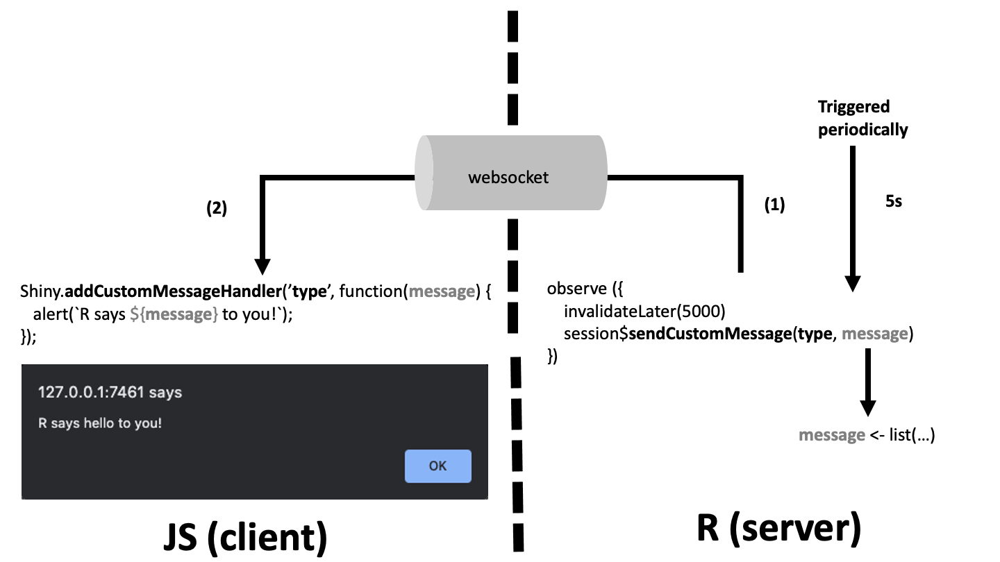

# Optimize your apps with custom handlers

```{r}
#| echo: false
#| output: false

library(htmltools)

create_note <- function(title = "Note",
                        text = ""){
  
  tags$div(class = "callout callout-style-default callout-note callout-titled",
           tags$div(class = "callout-header align-content-center",
                    tags$div(class = "callout-icon-container",
                             tags$i(class = "callout-icon")),
                    tags$div(class = "callout-title-container",
                             tags$p(id = "text-margin", 
                                    title))),
           tags$div(class = "callout-body-container callout-body",
                    tags$p(HTML(text))))
  
}
```


**Learning objectives:**

- Leverage internal Shiny JS tools to build **highly interactive** and **optimized** interfaces

## Introduction {-}

Many functions can update the UI from the server

- **update** functions
  - `updateTextInput()`, `updateTabSetPanel()`
- **toggle** functions
  - `hideTab()`, `showTab()`
- **modify** user interface elements
  - `renderUI()`, `insertUI()`, `removeUI()`
  
<br>

```{r}
#| echo: false

create_note(text = "The aren't many of this functions, which often obliges to use packages like <code>shinyjs</code> or write <strong>custom JavaScript code</strong>.")
```

## renderUI and uiOutput {-}

- `renderUI()` and `uiOutput` most famous way to **render** any HTML block from the **server**

- `update____` and `toggle` tools are component-specific, only target the element to modify

- `renderUI()` re-renders **the whole block** each time an associated _reactive dependency_ is invalidated.

- Results in **poor performances** in complex apps.

## renderUI and uiOutput Example Code {-}

```{r}
#| echo: false

create_note(text = "We used <code>do.call</code> to execute <code>dropdownMenu</code> in order to update the number of messages in the menu bar.")
```

```r
library(shiny)
library(bs4Dash)

new_message <- data.frame(
  message = "New message",
  from = "Paul",
  time = "yesterday",
  color = "success"
)

shinyApp(
  ui = dashboardPage(
    dark = FALSE,
    header = dashboardHeader(
      rightUi = uiOutput("messages", container = tags$li)
    ),
    sidebar = dashboardSidebar(),
    controlbar = dashboardControlbar(),
    footer = dashboardFooter(),
    title = "test",
    body = dashboardBody(actionButton("add", "Add message"))
  ),
  server = function(input, output) {
    
    messages <- reactiveValues(
      items = data.frame(
        message = rep("A message", 10),
        from = LETTERS[1:10],
        time = rep("yesterday", 10),
        color = rep("success", 10)
      )
    )
    
    observeEvent(input$add, {
      messages$items <- rbind(messages$items, new_message)
    })
    
    output$messages <- renderUI({
      lapply(seq_len(nrow(messages$items)), function(i) {
        items_i <- messages$items[i, ]
        bs4Dash::messageItem(
          message = items_i$message,
          from = items_i$from,
          time = items_i$time,
          color = items_i$color
        )
      }) |>
        c(badgeStatus = "danger",
          type = "messages") |>
        do.call(what = "dropdownMenu")
    })
  }
)
```

## renderUI and uiOutput Example App {-}

<iframe height="650" width="100%" frameborder="no" src="https://shinylive.io/r/app/#code=NobwRAdghgtgpmAXGKAHVA6ASmANGAYwHsIAXOMpMAGwEsAjAJykYE8AKAZwAtaJWAlAB0IdJiw71OAFgAiUHsIgiIcAO4B9eJ05QA5nAAEAHgC0hgCZRSUDADNm8diMOHtug4YC8hoWABy6m5wOvpwfrguhg5EMN6+YAAKUACu1BFRpLTw8X6sIeSMVqwZEK7E1ESMuWCcKQQEIZx+IkoiPHysAILozmWGKbTxVjz0RCwWyQZ9rq5WjADW8QBiXQAyAMoAopH9rtxwUBZw1T4j3GMTABKHx4wzs66MtHrcpACqQz6DAPIppKh-s4wO4ws08IZiGQoHwTvEbHpOAASOhKR4CXaPTi0Y70FjDBQXcZFDY4uB4+4YqLlEikRhEagUgmjYkWADCtPpjJY7Cpe2iRCIhWZRImy0FhV5mNmWVI1CMPj85E4pFKjzGFlYIsuRQAQkRNewoAQsiRdf9SCRgUcLBEEl0LBZgqEDH4BGjDHzXJwTgA3OE+OwpCAm2hWviA0i4QxEf6RgSGEDU3z80EGTgmcyMQ6h-0ANSg1BSIQej1o5BgGbO1lsDlgcFLj2dHgVhmzqGBXWbYTtACYvU3XDE4j41lsACrjrZYDbAACMiF7AF1pYOsjkfO3gfkVSdin2B4OKlV4lu-HUGk0D8nXB7b8nk0QpH64Ft-WR2BH-kibdGk-zXDTEIkXLOBK0zNt6D4Cx2CA5FQMraNVE0IC70MABfNDHzjb84Ig7MIDud4AEl2H-QdqDQVBqA4H0AEcNHlCB2Agek1FgpowRAitOHdaMgxDU1mNoBNyMHQwEM4DQhjMbt024sDOGAWhoyXG9ZikORCUQRAgOIitG0HID4kk6SkSA1dxOHEyeLM4dLLXbJW1M2gkXXOAHKbY9Tgk2zXO89T7wAjCEwAHwAPkCyF2DxCwDA2GxSBSKsEisCADEYNVxNcUhWFQVs-Dgt1DAiqKLCIDACELah2DUbhrBqCx6VQcq1AgABZCgUjdZNMKidDWjAdClyAA"> </iframe>

## renderUI and uiOutput Example HTML {-}

```{r}
items = data.frame(
  message = rep("A message", 2),
  from = LETTERS[1:2],
  time = rep("yesterday", 2),
  color = rep("success", 2)
)

lapply(seq_len(nrow(items)), function(i) {
  items_i <- items[i, ]
  bs4Dash::messageItem(
    message = items_i$message,
    from = items_i$from,
    time = items_i$time,
    color = items_i$color
  )
}) |>
  c(badgeStatus = "danger",
    type = "messages") |>
  do.call(what = getExportedValue("bs4Dash", "dropdownMenu")) |>
  as.character() |>
  cat()
```


## insertUI Process {-}

1. `insertUI` sends a R message through `session$sendInsertUI`, via the **websocket**.

```r
insertUI <- function(selector,
                     where = c("beforeBegin", "afterBegin",
                               "beforeEnd", "afterEnd"),
                     ui,
                     multiple = FALSE,
                     immediate = FALSE,
                     session = getDefaultReactiveDomain()) {
  
  force(selector)
  force(ui)
  force(session)
  force(multiple)
  if (missing(where)) where <- "beforeEnd"
  where <- match.arg(where)
  
  callback <- function() {
    session$sendInsertUI(selector = selector,
                         multiple = multiple,
                         where = where,
                         content = processDeps(ui, session))
  }
  
  if (!immediate) session$onFlushed(callback, once = TRUE)
  else callback()
}
```

## insertUI Process {-}

2. But before, `shiny:::processDeps(ui, session)` returns a list with **rendered HTML** and **dependency** objects.

```r
processDeps <- function(tags, session) {
  tags <- utils::getFromNamespace("tagify", "htmltools")(tags)
  ui <- takeSingletons(tags, session$singletons, desingleton = FALSE)$ui
  ui <- surroundSingletons(ui)
  dependencies <- lapply(
    resolveDependencies(findDependencies(ui, tagify = FALSE)),
    createWebDependency
  )
  names(dependencies) <- NULL

  list(
    html = doRenderTags(ui),
    deps = dependencies
  )
}
```

## insertUI Process {-}

3. Sent html by Json to Javascript.

```r
ShinySession <- R6Class(
  'ShinySession',
  private = list(
    sendInsertUI = function(selector, multiple, where, content) {
      private$sendMessage(
        `shiny-insert-ui` = list(
          selector = selector,
          multiple = multiple,
          where = where,
          content = content
        )
      )
    },
    sendMessage = function(...) {
      # This function is a wrapper for $write
      msg <- list(...)
      if (any_unnamed(msg)) {
        stop("All arguments to sendMessage must be named.")
      }
      private$write(toJSON(msg))
    }
  )
)
```

## insertUI Process {-}

4. The `MessageHandler`

  - Checks whether the provided selector has multiple DOM elements
  - Calls `renderContent(html, el, dependencies)` which triggers 
  - `renderHtml(html, el, dependencies)` processes the provided HTML
  
    - Renders all given **dependencies** into the page’s head.
    - **Inserts the HTML** into the page at the position provided in the insertUI where parameter (`insertAdjacentHTML`).
    - Initializes any **input binds** them to the scope.
    - **Sends** the value to the server _(to invalidate output/observers)_ and **connects/bounds** the outputs.

```javascript

addMessageHandler('shiny-insert-ui', function(message) {
    var targets = $(message.selector);
    if (targets.length === 0) {
      // render the HTML and deps to a null target, so
      // the side-effect of rendering the deps, singletons,
      // and <head> still occur
      console.warn('The selector you chose ("' + message.selector +
                   '") could not be found in the DOM.');
      exports.renderHtml(message.content.html, $([]), message.content.deps);
    } else {
      targets.each(function (i, target) {
        exports.renderContent(target, message.content, message.where);
        return message.multiple;
      });
    }
  });

```

## insertUI vs renderUI {-}


| **Feature**             | `renderUI`                                                                 | `insertUI`                                                                 |
|-------------------------|-----------------------------------------------------------------------------|------------------------------------------------------------------------------|
| **Mechanism**           | Re-renders the *entire* UI component and replaces it.                      | Inserts *new* UI elements _without_ modifying existing ones.                |
| **Performance**         | Slower (reprocesses all HTML/dependencies every time).                     | Faster (only processes new content).                                        |
| **DOM Updates**         | Forces full reflow (replaces container content).                           | Uses `insertAdjacentHTML` (minimal reflow).                                 |
| **Dependencies**        | Re-resolves dependencies (CSS/JS) on every render.                         | Processes dependencies once for new content.                                |
| **Use Case**            | When the *entire* UI component must be rebuilt.                            | For *incremental* updates (adding/removing elements).                       |
| **State Preservation**  | May reset inputs/outputs (re-initializes everything).                      | Preserves existing states (only binds new elements). |

## insertUI Example Code {-}

```r
library(shiny)
library(bs4Dash)

ServerFunction = function(input, output, session) {
  
  observeEvent(input$add, {
    insertUI(
      selector = ".dropdown-menu > .dropdown-item .dropdown-header",
      where = "afterEnd", #After the selector element itself
      ui = messageItem(
        message = paste("message", input$add),
        image = dashboardUserImage,
        from = "Divad Nojnarg",
        time = "today",
        color = "success"
      )
    )
  })
}
```

```{r}
bs4Dash::dropdownMenu(badgeStatus = "danger",
                      type = "messages") |>
  as.character() |>
  cat()
```

## insertUI Example Code {-}

```r
library(shiny)
library(bs4Dash)

ServerFunction = function(input, output, session) {
  
  observeEvent(input$add, {
    insertUI(
      selector = ".dropdown-menu > .dropdown-item .dropdown-header",
      where = "afterEnd", #After the selector element itself
      ui = messageItem(
        message = paste("message", input$add),
        image = dashboardUserImage,
        from = "Divad Nojnarg",
        time = "today",
        color = "success"
      )
    )
  })
}
```

```{r}
bs4Dash::messageItem(message = paste("message", 1),
                     image = "https://adminlte.io/themes/v3/dist/img/user2-160x160.jpg",
                     from = "Divad Nojnarg",
                     time = "today",
                     color = "success") |>
  as.character() |>
  cat()
```


## insertUI Example App {-}

<iframe height="650" width="100%" frameborder="no" src="https://shinylive.io/r/app/#code=NobwRAdghgtgpmAXGKAHVA6ASmANGAYwHsIAXOMpMAGwEsAjAJykYE8AKAZwAtaJWAlAB0IdJiw71OAFgAiUHsIgiAynEYA3dQDEArhAKlaJAAQBeEwDN9h4xHZ9Uu0rhNFnTlyc5xOnOwImICImJiFuUupaAKJaZA4QngAkUAAmqa7BEKGhfD6MpACqAJLs4TnecNRwhkSM5mFgGKmMRKipRADuEAC08BC6JgB85RUmza3tXb205DATbR3dPdxwaepCeKOhnauMcA2bUJbkjNEQqZu42ya6tA3wflAA5nDFc2XZY6GPnC8HFlQCnIZTAv3+VxMjmcKXSAmuX2+tBg-waqQU3HoRBYqUK+WKKNeCO+oUsrRghzAsloGjSJgAckQAFbQRjPK43UJGeCU0hEdGsDmIsbEah1SmcXQEAi+TibG5KCqKkwAXyUKpEInRPCxOLx6gJqIAPD1GtxSKRUJxEAB6G1pGB8ajkDDGG2kVaPG0aADMNtStE4pBtyOeNt0+QATD0AIwANgADAAPeMJjBM1DssCaiC0ujo8gAfSDUFIEZMJqsNiMJC4pFLEcCWXCedoqWL9bLPk4FdNBE+FU2qEYyIkQsHYB8xAuY62ws2kulsvHOU2fEsRBXoU2nRYED4WeJq7A6Igr0YW8adGe5svm3RjAA1vKvkpwrRLCYHJwMANqNQ6wbTgBCbUZ9jLRh7AAFSwQpomVFUTCqHwglGD8vxLLsTAAUj4bCTFbdtMIjXxQOFUJwN0SD2BguDlVCDUvkY8IgzaUFilzKB828TsI0QRpXGIzhXE2DATAANS4tseKA3wTBYOB+MvHIgSDOB2EIjtZOEkxRWoNAUIsSFNnhRoMBMkRmIuSYlggABZChBkrawDBrewMA81xSFYVAAV00FwVeOU8EaCAiCMSxaAIUs7GCkSwHrThH2C+FORJdKcnoNJXhUXieyMsBh1HNhISi0wLHpQoABkqtcVZ1kYKC4CTUgGkqmqjwyrqKgwOggza6rapMbh9k-CrBrIrkfIOSsUVIAhuAwFhnnYbzfOVdD2AAQkDX9dH-dgstSHK8pAgipILOAtK7Q7srgXKgI2uYe0rfs+tIdgPIwUzesDUg3y+ABiEw7KgR8DklfYTA9A5ZjgGAewU+ToZeOUgZMfT0GoDg4YRryXgAQT8dQvDWvyjkhAh9L8SkWkWaYelxizlC+Tbdr-ACyogM6sgqLne28TpZgWgcxjJzqckCuSLB4PhWEQRAudBYgYH6UgUol0IwoiqKYpIfLvF4fgFaVzZ6CqagTM1lGkoN2XjcV6dQUS5LmaVcIrK13QYHeeGXtNaozw9BxnoB3JP2-PaDqOk7HsmzK7oF9qqo9pDqBQ3mE+OmbTXt+XEE4IF7CphQDdU8gE1BGODmrnpIWrh6u3ikxoA0LLGB6aurZb73fYRhCc3Dr92f2gD6tSdQmpannRnHyfmtayty-UzYAE13GGqAtEhAYfeerzpoHlnQjzhX62eTgkjoUXQkBumpm6WQ4CtdhUuFEuaYK1vGbmEx79sy8p9EDn0vlAG+OQP4G02N-OgEBnxzm+AAAwLFAHofJnjPGqIg2mNlpjKWGqNSkgN8GIJYLQVBzUi4T1SNggqlguI+HwVza2XdhRvwqEAkBSQAwaHAaESBDRC4jjIJYUE-8Gb9EGOI5YkiejUCzOwsYnDUZJELlAewaUBEFWkTMX+OiVhrAnheBBJI56NQXgqa2yiL7cJpOwLRjR9E8LbBsMAii+b7xuJtHaP4ObsBGnASwM9yI5GsaAvhIpqZQJPLg5YuM-6xN6BucKrjrYVACWNAhgS0k5HrGyOArUCqFnoPpOB+CJx2TqHAF86V6I5EYu7V8lkcw6IcgMEoAsXK2FrAIZsXwpByAxArbUmJsSMFSAABX+J8UYD5HwNG0ATKqKhogIlnoY9QDQBnyB4MMjEupxkAAkNmMAiSOG8RR7gWFaY5CJoQG55Vpuo885TobTUpFLYKCpRhv1GP4Ce7ctkyB2dwPZOoxmpBUC49ur81nvxIKQVo1BAUWG2UMxAIyDmpAAMIIqRTC35wpkmnCBYM3ZGL9kQu0EQFJpzCUVCMKQaovJfCkCFKMLEqRWCkpBWC0ZOIABC-IOA3CgN0iAArnB8g0SgdIxkwAE3SAk+m3QoRzBMsqAGVk84E3QKLO4DRlUP3so5Eor8TBHnyFoeoFg1CaB0NWOwIgBBgBVAAXSAA"> </iframe>


## insertUI Example App (Updated Selector) {-}

```{r}
#| echo: false

create_note(text = "In the original example we were missing the division line between \"You have 0 messages\" and new message. <br> <code>selector = \".dropdown-menu > .dropdown-divider\"</code>")
```

<iframe height="650" width="100%" frameborder="no" src="https://shinylive.io/r/app/#code=NobwRAdghgtgpmAXGKAHVA6ASmANGAYwHsIAXOMpMAGwEsAjAJykYE8AKAZwAtaJWAlAB0IdJiw71OAFgAiUHsIgiAynEYA3dQDEArhAKlaJAAQBeEwDN9h4xHZ9Uu0rhNFnTlyc5xOnOwImICImJiFuUupaAKJaZA4QngAkUAAmqa7BEKGhfD6MpACqAJLs4TnecNRwhkSM5mFgGKmMRKipRADuEAC08BC6JgB8Js2t7V29qbQatKnqQnjlOZ3c6nANi1CW5IzREKmLuMuhurQN8H5QAOZwxeQwZdkVOZecNxsWqArkZWBvHyOJkczhS6QEx2eL2BMA+DVSCm49CILFShXyxVht0h0NCllaME2YFkMzSJgAckQAFbQRjXI4nHJGeBE0hEBGsBlQl7Eah1ImcXQEAi+TiLRlKCqSkwAXyUMpEIgRPGRqPR6kxcIAPD1GtxSKRUJxEAB6E1pGB8ajkDDGE2kNaXE0aADMJumnFIJtoMGuJt0+QATD0AIwANgADAAPcMRjBU1D0sCKiAaKB0BHkAD6nqgpADJh1VhsRhIXFIeYDgSy4TTGZzFfzPk4hd1BCeFUWqEYPokXM7YB8xAOfaW3MWguFov7OUWfEsRBnoUWnRYED4SZxs7ACIgt0YS8adGu+sPiwRjAA1uLnkpwrRLCYHJwMANqNRy5XOAJq8tGHB80YewABUsEKaJpRlEwqh8IJlgfJ9cybEwAFI+BQkw6zmBsv18X9uVCf9AJAsCIOWBVngo8JPTaP5ilTdM5m8RsA0QRpXCQgNXEWDATAANUY1JmNwlsWDgNjDxyb5PTgdgsNSHCm18VxeWoNBYIsIFFghRoMG0kQqIOcYOm6ABZChBiLawDFLewMHs1xSFYVBPhMdtFgBW4xTwRoICIIxLFoAg8zsbzuLACtOEvbyIUZXF4oqeg0luFQWJbTSwG7Xs2CBILTAsclCgAGSK1w1jSdRgLgKNSAaQqSq3BKmoqDA6E9OritKkxuH-R8Cs6-DQiclzWxMWFSAIbgMBYa52GGuBpQQ9gAEJaBfN8PyS1IUrSn9MMEvM4EUgN2C2nav0Wh4WyLds2tIdh7IwHTWrW0g72eABiExTKgS8NkFf8TAdDZaCukwxPBoGbjFT6TDU9BqA4UG4BgThHJuABBPx1C8eaiSgIECDUvwiRaNoTN6ZGYH05RniWtbX10d8HGHPasgqPLsiLThOlByaOxeebGteUUPnS7xeH4RBEE5v5iBgfpSBi4XQj8gKgpCkhxZ4PhWGl2XFnoKpqG0lWoai7XJb1mXhz+SLoppqVwkM1XdBge4Ueu3Vqj3B0HCu97ckfZ9GeZs64FSi7BpycPRvqorneg6hYPZmPko2bmrelzhvnsImFHF6TyAjP5Y-DnogXDyOm3CkxoA0JLGB6cPTbrt2PdRyCUyDp8GY29hyvmRgqpqtnlkHyrqtqosi9kxYAE13G6qAtCBAZ3auxznIW53u4l3XpYra5OCSOgBdCD6yYmbpZDgI12Fi7l85JjL656KmTCvinDx1qXECPk+UBz45GfuLRYb86AQGvGOaEAADTMUAehsmuNcaosDSbGUmJJbqvUiQfWwbAlgtBEHVVzvMVI6CMqWHTD4bBnMzYt25I-Cov9rYAKSNMDQwDQigIaDnHsZBLB-C-pMPoFlP6YO6GIgYPRqBJmYS8Vhh9oZJBzlAewcU3LEzATuSRlMHgSPJqIieB4YG4hMSPUgEozZKP-iozh7BeEZREVIzhcwFhgAURzTejIlqrXWkzD8PU4CWDHgRHItj2FAM0Tw7RGCjFSI-i43oC5-IeLNhUYJfUcEhIyUyGaAEiRZnoGpKB2CBymTqHAG88VpQVAok7W8BkUzJPMgMEoo1rK2DLAIGszwpByERNLZUSIUSMFSAABQ+E8ZYF5LwNG0BjIqKhoiQnHnACq9QLADPkDwYZiJVTjIABIbKHtwkwPYTxFHOBYVpFlzmhCrmlUm6j9zlKBtvIknlfA1JeHUkwj9lj+HmI3BoOyhmIBGYc1IKh3GNwfmsp+JBSCtGoKC7ZMhdncH2SqMZqQADCyLUXwsBdyVJuwwWYohVCvF2giBpMYAiveQ1QbVFZL4KxY5ljIlSKwSlgy9mQoOXigAQuyDgjIoDdIgCK5wbINEoHSFpMAGN0iGOvtkKm2lpTvUMqwjG6ABZnAaOqimbTdAlAfiYLc+QtBbJMGoTQOgSx2BEAIMAMoAC6QA"> </iframe>


## Updating counters Code {-}

```{r}
#| echo: false

create_note(text = "To update elements we need to remove them (using <code>removeUI</code>) and then inserting them back. Make sure that the observers for <code>removeUI</code> have a higher <code>priority</code>")
```

```r
ServerFunction <- function(input, output, session) {
  
  observeEvent(input$add, {
    # remove old badge
    removeUI(selector = ".badge-danger.navbar-badge")
    
    # remove old text counter
    removeUI(selector = ".dropdown-item.dropdown-header")
    
  }, priority = 1)
  
  
  
  observeEvent(input$add, {
    
    # insert new badge
    insertUI(
      selector = "[data-toggle=\"dropdown\"]",
      where = "beforeEnd",
      ui = tags$span(
        class = "badge badge-danger navbar-badge",
        input$add
      )
    )
    
    # insert new text counter
    insertUI(
      selector = ".dropdown-menu",
      where = "afterBegin",
      ui = tags$span(
        class = "dropdown-item dropdown-header",
        sprintf("%s Items", input$add)
      )
    )
    
    # Insert message item
    insertUI(
      selector = ".dropdown-menu > .dropdown-divider",
      where = "afterEnd",
      ui = messageItem(
        message = paste("message", input$add),
        image = dashboardUserImage,
        from = "Divad Nojnarg",
        time = "today",
        color = "success"
      )
    )
  })
  
}
```


## Updating counters App {-}

<iframe height="650" width="100%" frameborder="no" src="https://shinylive.io/r/app/#code=NobwRAdghgtgpmAXGKAHVA6ASmANGAYwHsIAXOMpMAGwEsAjAJykYE8AKAZwAtaJWAlAB0IdJiw71OAFgAiUHsIgiAynEYA3dQDEArhAKlaJAAQAeALQmAZvsPGI7Pql2lcJoq5duTnOJ04HARMQERMTMI8pdS0AUS0yJwhvABIoABN091CIcPCAYhNGOBgiLQ9qdJN6DIBzOEjw4tKtAFUASS44ajhDIkYTAF4IsAwa9PqLdKgIesYMaA0axgtx+qEwJTyI3LzC5rK4CqryAA9SE2J9ckZGopLDjq6evoHhjYx0xiJUdKIAdwgFlo5Bgn2+vwBQO4cAy6g2WzykQAvu5UIxjBjSKwhiYAIyIyJE3ZEaKaODxCikJKpDJZEJ3O6FPh+RgXCBwf7VOoNXbhFnqUhPO7hPwvUj9XEbYDTUhQCwS2q1HqDIRqsBfH5-QFqjYAXQ2uBFJn+MOKUrA9Dg1n6FIg6UNxt0tFxctqnBSnFQM3YxvCBGoCk4FrWR1DUxmcxMi2Wqx5jr52xMzlcaUyxsR4UzO22zIgrPZnJMZwuVzI8MTArZwsTou6vQlbxG4K1UIs8AgugTSZNZqO7xQ1huACE4LU+N2k87XVB3Z7vY4-ZdAwELZrIYDgaCTOvtdDYel4Xgl16MWRrL6wABSYPtUGcQ3J5KpunZrN3bNMkztfOCkzwAJZyOEESjuKshU6Y0xQbSUBxbDcgQ7XQTAAPhMeC9ymWgNFoQ9bmPWte3UfsRigId1Fie1J22adhgAzggLvEpfUI8J6KA3FvU4chL3Y9Y8CfWlMgEI1WOTGAOOGaYeHoIgWHSVpWXaCT6lEntwmsb4YAtWRsIyEwADkiAAK2gRhamopMjHgC0JWmVhLO2YhqFgkZOF0AgCH8B8wAzD8UUJCBkREERpO4WT5MU9RlI4ywRm4UhSFQThEAAelSjIYD4ahyAwYxUtIGEANSjQAGZUvSWhuNS2gYFqVLdFZAAmCw8QANgABlOdqOowYzUAs3zlAgDQoDoWU4AAfW4qBSEa8wrFsAwjBILg5TmzhghySJRvG6b1sa-wFsuFjtg2dFaokSyNj8Yh7SugizrAdzPO866wD4G13v+FgID4Qa1KRDVIyPQHwg2OhagS97pkYABrDZIiUSJaGsEwnE4BZdGoag1tmxqBC2u5ijmxhHAAFSwVpYkRZETG6PwGUrNG8Y2kwrz4K8TF23D9vxvxNqZnsSd0Mn2Ep6ns2C3ZpcibifkvH8eaqGaNsQEZ3FVxr3A+EwADUxtw3wDoFkwWDgdXHPCLieOVvmNv8dxnMDZKSMfBEddGBERFl+0IT3ABZChkLipb7FWjBI-cbFUBIgheO8oCfM9iAiCMaxaAIWaHGTkY5U4OGfJEpd1NL8JQxUE2LQuiS2EfTPTGGAzWgAGRb9wYThRhybgc5cWbtuwbL4e8gwOhuP71v25MbhijRpup6J3YY6OOKJNIAhuAwFhanYFfEVR9GAEIqqxnH2Ark3Ce5w2JvtxqL55Sv+YP+9jvj8fqUjjARPQz-kd2IUAOUA4ZHHcuaQqwE37mzNsWWcD5AEmBdqgagHAQIwE4NHWcABBAIgpo6sFjhaKAj4AxBjXP7Ns6DvbDX5CzU+nZz4NwgNfHI2xmHHU4P8EEm9TpWUIXAIebFE71GDMMHgfBWCIEQMwy8xAYAdlIEXIR0Y06o0ztnEgYjfC8H4NI2RGwrQ4w9safOhdcQSL0TIu6l4zFF38jLEKuxOwwCYhg46PRZiFScPeABdD0YMOxrjS+L8l7bFDMdAeLcUT02oIzNheQIlxUsVIxAXofRkNXMMG2cAOqXgieGR8ISNqe2jFAJYLA4wTAaJsdwLi3GbRRE4-xGMz6407nhHu5xWF3A6eoLpFw4o5MvAATU8DPcpNS6m6FcfeAhsdabNJ0ZI6RboPR0D4QUXcUJZBwGSuwYuiZMnaI2IsLcJQdyUJ1I9PIKTVnwLSJsvIxyLRnLoBABGNztgAANZTykVMqOA3yKGtmuSo2e1oLT5Ctt8lgtB5S9wXIedIwKBzWDGn4K2zCVGhg-EPO5iA1kpEqhoJ5-oVzaNPHwUgF4NjbM3EhS5oLELBwsNQQahyewEqJekxcYkXkDnpUCdBTKEIWD6fhFR4QJUDIzCo7lDySXsAFSMIVWEcJ4RMYRdBmDjSH3YCfTGjD2lzx6WJBVc4oBkqTCqulVzhXbjVTaNOoMS4zznriCF1gpV5DlOZOAFwByTXoIGD5VsnoB1tIjMSb4TDS22IiJQvshVB07B0Y6YcVqOAENtXYUg5AKG4NIsKEVGDpAAApARYncWGcNcTaGwS3FQsRRK9IPOoXE+b5A8GLYW0t6QAAS7bGDWoxFDIULopL2tTboa15cn5V0FSDSVS4V4Wj4v4aNPZsyHLuIEQ8yxO0yG7UWxAJa5JlpULhOAywDmtqOSQUg3xqCHuGF2wtvaZIXvSAAYUfc+29u7EzOpuEegtPaz19u-doIgLqR1Ae2EYUgPRbL+FIAmO4sl0g4jfcej9kGv3yWHEQbD1qoDhwgMOVwEpFwoHTAJDY2DMiir3MmUECJE1ON9ik7B6A+G0XCCm4OTxgiA1ZFoJsahySMD0MtBwIgBBgGRHqIAA"> </iframe>

## Custom handlers Diagram{-}

1. **R** sends a message using `session$sendCustomMessage(type, message)`.

2. **JS** apply a defined action based on `Shiny.AddCustomMessageHandler`.



## Custom handlers Example Code {-}

**add-message-item.js**

```javascript
$(function() {
  Shiny.addCustomMessageHandler('add-message-item', function(message) {
    // since we do not re-render the dropdown, we must update its item counter
    var $items = $('.dropdown-menu').find('.dropdown-item').length;
    $('.dropdown-item.dropdown-header').html($items + ' Items');
    $('.nav-item.dropdown').find('.navbar-badge').html($items);
    // convert string to HTML
    var itemTag = $.parseHTML(message)[0];
    $(itemTag).insertAfter($('.dropdown-item.dropdown-header'));
  });
});
```

## Custom handlers Example Code {-}

**app.R**

```r
library(shiny)
library(bs4Dash)

insertMessageItem <- function(item, session = shiny::getDefaultReactiveDomain()) {
  session$sendCustomMessage("add-message-item", message = as.character(item))
}

dropdownDeps <- function(){
  htmltools::htmlDependency(name = "bs4-dropdown",
                            version = "1.0.0",
                            src = c(file = "."),
                            script = "add-message-item.js")
}

ServerFunction <- function(input, output, session) {

    observeEvent(input$add, {
      insertMessageItem(
        messageItem(
          message = paste("message", input$add),
          image = "https://adminlte.io/themes/v3/dist/img/user2-160x160.jpg",
          from = "Divad Nojnarg",
          time = "today",
          color = "success"
        )
      )
    })

}
```

## Custom handlers Example App {-}

<iframe height="650" width="100%" frameborder="no" src="https://shinylive.io/r/app/#code=NobwRAdghgtgpmAXGKATVBaeBnbUDmcGAlgC5wwB0AVtmADRgDGA9hOe0mACQAUAZgFcITUsTa8AlAAIQAHQjTpAZQAWxCAE9KaVAGFB2UixgBZOLgJwAElAioANnABOvAOS6sFvIRLkYbvTSQiJiEjg+cDLyikrSAPTx0tgaTHDSAO7pqCzSECyk0s5ExfYu0qSq2c4sAA45GRBBWdIwhoWC9VDk0mTYvf7SrMLkzgpx0gBuUM7S3GQU-QC8c+6UqDX1LI1eEIJukpT8GqhrG3UNEH4UB5ROEPiVANzjcXxu65uX11TnWztVNAuW6qUgwBy8eb+foAamkbmkAEloQcXrElO9KNBJj9PhdthBbsd7GtsQAjGYYCmoQggsEQqGLSRoiaJIZsSYuQpGZwafAVXLWAAqpgAMq8lNNZgsYEKCNIVtxKLUZtgbCLRbwIlZJMAAAwAXRZb14Mrl+EOGjVzlIAEF+KNIWcvgTcX9voDUMDJMzXgBfX0QANPMB++jgaDwLhQWq1SgAJQYzDYHFIXAcxDJzhmml42HUWkkCgzWZzvDJ2AALAARKD5osQBRWrnmSyEZEUaQAHgwwWEonEEFN-iCatwg4VyQLmkQiEIpGrcH4UEEDlI8bgUAHnOrJigGik0VeY5SbG4avsBiMJlbkV4chQ6C8baIMofQW1hEndcoTFUMy3R0ZR9BQ-QUBR3QJRdan6Hs+1CQcpBiJRQXBYwWAcbBZ1QhxoLgMoRFzSN0hWB8K0rDBIMad8JQmOj6IYuJOWcU9FFIsAAEZKD1biaPRRiBMY7BnCYScmAEYgnEnB9KAfSR6FowSlLibAmF5WpCnYzxP1ffwaGwOTQPAiBlBcZiADF+zCRQ4JCAcJA0WpBFIIIWGcpyXOSbxByPRt+JYCszLgABRTl2FNCAPO4XQgmQujmxtW8rA7GB734iYdJStLBJ0ycVSMOB7zAHT316SLnOi9B5MU+KYCsaSwFBUgYMQRI0BgDQ1zgShxHiSoKAseJJgAZniVBiCMeJiBgfB4kMFwACYMA4gA2PUAA9Vp46hanwPjBP4GoYAa6tiGmVBpAAORYahoGcPaGBqiYxHgBrjFQKBNH2gTWAcFhZnY7BBCYNJcAfJ7pAbeiobiANjLAvyFGmDMPvIAB9IxukMbtezs6y81ILHsF815keIVAMcJ0h5tg3txNoh9al5OrnC+x7+IfNVWHsHNvqUTngdBgz2YmB8NH4Fg+ekB8MhmCA+Slh8PoeFxFbADN8FBNWPucABrcHYgbV5iH4aRTWwLFVwhTHqeJ3yJmKannCHIV4wAVWCmG-WkOBMPSOKlBNs2bexgBSDRQ6mKAUcpomLHtujHcEZ3eFdj2YaUBHM+MpRr1qIrEQgMmLpDrDpYYZIqcMIIZOkAA1aPycruP+hmOBEHLhT0qUfLyF4YvY9tiwgl+hwYzVBqa7AeTy9k6ejL8qiIHMPYcfg+yh0oLeglITRahIoYip04Wp-yMRjiYbpBxP8vCewXXheq7vlIY6lCGUKvlnLpnpt5iviG5pOS6btRSiiCJ6FwQo4DrU0ldEBYCIYvwmHcCasDgGgPAcUU2Kx0GigTrvfea86qkD-Doe6vACFRGNqbXgABCCalsHAQjfnAD+RMfRRxRt0OAg9DDljQO-T+MMZS00PhmIwvAt6UBnigowRtYgAGJpCmCgLrdIQNigVCqAMRY0g256IqAQAyijpBj1jA4XMIid4EFtLgLkO894HwfFAUqTAx64AakvH4hk-KBxoQwvYTDTTcw4QHXogC4LYAyGQP82U6KUK7vRY+k58waBnIgABEgHysBgPAdgj9El0TPibABV82Bf1SVoWcmShxkV9g4OShTnp1gfik6c1TuZFTvg-HxEwvY5zyIIGAKVRH3EeKoYcTIBlB3Now5hAjWFCITkoFha9cH+h9n7WQtFVmRPaYgbAKohxuLrF-XucA9RFVWSwjApUWFsNtlPPIUBJgUmcFSBZjTBnDOhP03xvR-EW0CRCCBzgoEwNCbRUF4LChwXOUVAAmm5aQ-5OSlT2D8xYDj95-OPPswm+BsDcAzGlWiSjbToGIPyaCxiJhLxpVILutETkePYtiH40gl5S0qekglRKoBxImCyr+D52UZggPrEWdEAAGqMoAYGMPgfAThpWeJdNRKVExVBYIagoqWShpUzGIPK6BRyvSoFVexZcft9XhLYE0uILDaJPwmDy2cfLuDjUmIKuIwqUk-3YPwIqXi8mCE5eqq4oaMAOAei6uibrEAesOXYH1Qr3EirAF4mU4b8QAk3F6MYmq6LQugaQGqcbXX4qMZ6s6vA-XsS8V68mqtp4OsDtCNtAKzb0KBVbXg2qlyQuflONJ7rq0CsQUMdNarc1XGzV4iWBQW2dq1TqlYA7+ArriITe6cBYEPjRmSMeErbWizAKYf6cADaMQzrDZ1rwGwIwghGlegg3aIjXnjRCkgYivHIrWfMs4Pr5jJCwGYqAAAKVhSX8R1rrSc5lbSimUMFJl-FQWTn-XWVQQHsOgfA9YfNLhU1FCpaCN2xBJxL1fSRlZCyHnYwbXYQghat2UIasfa9dFb1P1oikL0bzMNVgAzhxAwHVD4ecKgZQza3mMoGUobmpAagOEEysLDgGxN4bA1JvQKYVNyd4-xRdowhM1mw7hkDOnUDmRYEu1wRnnpkCkuxcgRg+I7JYKgTQZmROWYk9ZgAQl53MNVAKDkC85YwtTHyoFKg+ClF0l46JgL0uIMN5FPogDy20sY4mCEoysHN-xl74TfYiKQ0hCnWmYpOUyzgLJWUHAoBsoYDRAA"> </iframe>

## Meeting Videos

### Cohort 1

`r knitr::include_url("https://www.youtube.com/embed/l6BIOSHNCZA")`

<details>
<summary> Meeting chat log </summary>

```
00:03:14	Oluwafemi Oyedele:	Hello, Good Evening All!!!
00:03:24	James Arthur Shaw:	Reacted to "Hello, Good Evening ..." with 👋
00:03:24	Russ Hyde:	Hi everyone
00:08:34	Russ Hyde:	start
00:19:38	Federica Gazzelloni:	What invalidateLater(4000) would do instead?
01:01:58	Oluwafemi Oyedele:	Thank you!!!
01:04:57	Trevin Flickinger:	Note the session$ns that actually makes sure this function can work within shiny modules
01:06:38	Trevin Flickinger:	stop
01:06:42	Russ Hyde:	bye
```
</details>
