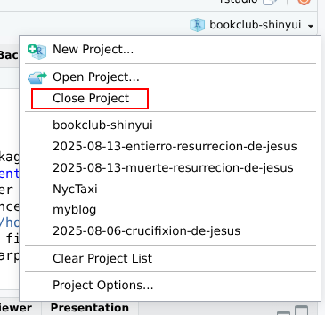
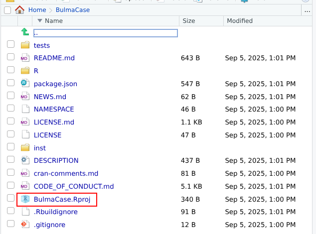

# Automate new template creation with charpente

**Learning objectives:**

-   Providing tools for **translating an HTML template** into **a package** that helps you to:

    -   **Document** the underlying API.
    -   **Design unit tests** to guaranty code robustness and improve long term plan.
    -   **Ensure file organization** to make easier collaboration.

## Benefits of using {charpente} {.unnumbered}

-   Eases the import of external dependencies.
-   Speeds up the HTML to R conversion like the `{html2R}` Shiny app by Alan Dipert.
-   Eases JS code management.

``` r
charpente::html_2_R('<div class="divclass" id = "someid"></div>')

#> tags$div(
#>   class = "divclass",
#>   id = "someid"
#> )
```

## Bulma study case: Create a new project {.unnumbered}

1.  Close your current R project.



## Bulma study case: Create a new project {.unnumbered}

2.  Use the package to create the new project directory.

``` r
charpente::create_charpente("BulmaCase", license = "mit")
```

3.  Open the new project.



## Bulma study case: Checking Results {.unnumbered}

4.  The description file doesn't import `{charpente}`.

``` r
Package: BulmaCase
Title: What the Package Does (One Line, Title Case)
Version: 0.0.0.9000
Authors@R: 
    person("First", "Last", , "first.last@example.com", role = c("aut", "cre"))
Description: What the package does (one paragraph).
License: MIT + file LICENSE
Imports: 
    htmltools,
    shiny,
    utils
Encoding: UTF-8
Roxygen: list(markdown = TRUE)
RoxygenNote: 7.3.2
Suggests: 
    testthat (>= 3.0.0)
Config/testthat/edition: 3
```

## Bulma study case: Checking Results {.unnumbered}

5.  On the project we can find `R/BulmaCase-utils.R` to make available functions to:

-   Facilitate HTML dependency management

    -   `add_dependencies`: Attach all created dependencies in the ./R directory to the provided tag.

<br>

-   Validate HTML

    -   `validate_width`: Validate Bootstrap compatible element width parameter [1,12].
    -   `hasCssClass`: Return `TRUE` if a shiny.tag object has a CSS class, `FALSE` otherwise.
    -   `tagAssert`: Check that a tag has specific type or class.
    -   `tagMatches`: Check that tag has a particular id, name or class.
    -   `findAttribute`: Find the child of the targeted element that has a specific attribute and value.

<br>

-   Avoid repeating code

    -   `equals`: Similar to `==` but safer in relation to vector length. `equals(1, 1L)` returns `TRUE`.
    -   `dropNulls`: Remove `NULL` list elements.

## Bulma study case: Install Bulma dependencies {.unnumbered}

6.  Go to the [jsdelivr](https://www.jsdelivr.com/) website and find the correct repository.

7.  The function `create_dependency` will take care of creating the next step for us:

```         
library(htmltools)
bulma_deps <- htmlDependency(
  name = ...,
  version = ...,
  src = c(href = ...),
  stylesheet = ...
)

add_bulma_deps <- function(tag) {
  tagList(..., bulma_deps)
}
```

## Bulma study case: Install Bulma dependencies {.unnumbered}

8.  Define the source to get dependencies:

+-------------------------------------+----------------------------------------------------------------+
| Locally (recommend)                 | Connecting to content delivery network (CDN)                   |
+=====================================+================================================================+
| ``` r                               | ``` r                                                          |
| create_dependency(                  | create_dependency(                                             |
|   "bulma",                          |   "bulma",                                                     |
|   tag = "0.9.3"                     |   tag = "0.9.3",                                               |
| )                                   |   options = charpente_options(local = FALSE)                   |
| ```                                 | )                                                              |
|                                     | ```                                                            |
+-------------------------------------+----------------------------------------------------------------+
| ``` r                               | ``` r                                                          |
| add_bulma_deps <- function(tag) {   | add_bulma_deps <- function(tag) {                              |
|  bulma_deps <- htmlDependency(      |  bulma_deps <- htmlDependency(                                 |
|   name = "bulma",                   |   name = "bulma",                                              |
|   version = "0.9.3",                |   version = "0.9.3",                                           |
|   src = c(file = "bulma-0.9.3"),    |   src = c(href = "https://cdn.jsdelivr.net/npm/bulma@0.9.3/"), |
|   stylesheet = "css/bulma.min.css", |   stylesheet = "css/bulma.min.css"                             |
|   package = "mypkg",                |  )                                                             |
|  )                                  |  tagList(tag, bulma_deps)                                      |
|  tagList(tag, bulma_deps)           | }                                                              |
| }                                   | ```                                                            |
| ```                                 |                                                                |
+-------------------------------------+----------------------------------------------------------------+

***Note:** The current version of the package only has the local argument in the `charpente_options`*

```         
charpente_options <- function(local = TRUE) {
  list(local = local)
}
```

## Bulma study case: Minimal page template {.unnumbered}

9.  Transform the starter page template in to R format using `charpente::html_2_R(template_html, path = "/html")`:

``` r
tags$html(
  tags$head(
    tags$meta(charset = "utf-8"),
    tags$meta(
      name = "viewport",
      content = "width=device-width,
    initial-scale=1"
    ),
    tags$title("Hello Bulma!"),
    tags$link(
      rel = "stylesheet",
      href = "https://cdn.jsdelivr.net/
      /bulma.min.css"
    )
  ),
  tags$body(tags$section(
    class = "section",
    tags$div(
      class = "container",
      tags$h1(
        class = "title",
        "Hello World"
      ),
      tags$p(
        class = "subtitle",
        "My first website with",
        tags$strong("Bulma"),
        "!"
      )
    )
  ))
)
```

## Bulma study case: Minimal page template {.unnumbered}

10. Create function of the page by taking in consideration that:

    -   Shiny will add the css dependency when running the app
    -   It's better to define another function to add each section.

``` r
bulma_page <- function(..., title = NULL) {
  tagList(
    tags$head(
      tags$meta(charset = "utf-8"),
      tags$meta(
        name = "viewport",
        content = "width=device-width, initial-scale=1"
      ),
      tags$title(title)
    ),
    add_bulma_deps(tags$body(...)) 
  )
}
```

## Bulma study case: Creating Custom Handler {.unnumbered}

11. Adding JS dependency.

``` r
create_dependency("@vizuaalog/bulmajs", "0.12.2")
```

12. Defining the structure for the notification.

``` r
create_custom_handler("notification")
```

+---------------------------------------------------+-----------------------------------------+
| `notification-handler.R`                          | `notification.js`                       |
+===================================================+=========================================+
| ``` r                                             | ``` javascriptreact                     |
| send_notification_message <- function(            | $(function() {                          |
|   id = NULL,                                      |   Shiny.addCustomMessageHandler(        |
|   options = NULL,                                 |     'notification', function(message) { |
|   session = shiny::getDefaultReactiveDomain()     |        Bulma('body').notification({     |
| ) {                                               |          body: 'Example notification',  |
|  message <- list(                                 |          color: 'info'                  |
|   # your logic                                    |        }).show();                       |
|  )                                                |   });                                   |
|                                                   | });                                     |
|  session$sendCustomMessage(type = "notification", | ```                                     |
|                            message)               |                                         |
| }                                                 |                                         |
| ```                                               |                                         |
+---------------------------------------------------+-----------------------------------------+

## Meeting Videos

### Cohort 1

`r knitr::include_url("https://www.youtube.com/embed/hzn4Kn4-cD4")`

<details>

<summary>Meeting chat log</summary>

```         
00:05:34    Russ Hyde:  begin
00:08:30    Trevin Flickinger:  Yeah, I’m utilizing golem now at work
00:58:15    Russ Hyde:  https://github.com/RinteRface/shinyMobile has the srcjs folder
00:59:28    Russ Hyde:  They load {charpente} in https://github.com/RinteRface/shinyMobile/blob/master/tools/build.R
01:02:36    Russ Hyde:  end
```

</details>
