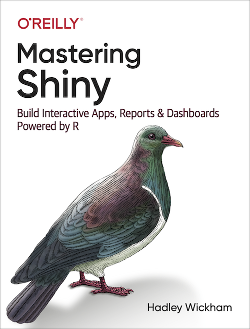

--- 
title: "Outstanding User Interfaces with Shiny Book Club"
author: "The Data Science Learning Community"
date: "`r Sys.Date()`"
site: bookdown::bookdown_site
documentclass: book
bibliography: book.bib
biblio-style: apalike
link-citations: yes
github-repo: r4ds/bookclub-shinyui
description: "This is the product of the Data Science Learning Community's Outstanding User Interfaces with Shiny Book Club."
---

# Welcome {-}

Welcome to the bookclub! 

This is a companion for the book [_Outstanding User Interfaces with Shiny_](https://unleash-shiny.rinterface.com/index.html) by David Granjon (Chapman & Hall, copyright August 31, 2022, [9780367645267](https://www.routledge.com/Outstanding-User-Interfaces-with-Shiny/Granjon/p/book/9780367645267)).
This companion is available at [dslc.io/shinyui](https://dslc.io/shinyui).

This website is being developed by the [Data Science Learning Community](https://dslc.io). Follow along, and [join the community](https://dslc.io/join) to participate.

This companion follows the [Data Science Learning Community Code of Conduct](https://dslc.io/conduct).


## Book club meetings {-}

- Each week, a volunteer will present a chapter from the book after assigning it to themselves in the **Volunteers Spreadsheet**
-  Presentations: 
   -  Review of material
   -  Questions you have
   -  Maybe live demo
   
<br>

- More information about how to present is available at [github.com/r4ds/bookclub-shinyui](https://github.com/r4ds/bookclub-shinyui).

- Presentations will be recorded, and will be available on the [Data Science Learning Community YouTube Channel](https://dslc.io/youtube).


## Pace {-}

-  Meet ***every*** week except holidays, etc

-  Meetings = **1 hour.**

-  **Goal:** 1 chapter/week
  -  Ok to split overwhelming chapters
  -  Ok to combine short chapters
  
-  If we need to **slow down** and discuss, **let me know**.
   -  Most likely someone has the same question 
   -  We are all here to learn 
  
   
## Introductions {-}

If you feel comfortable sharing, unmute or raise your hand!

-  **Who** are you?
-  **Where** are you joining from?
-  **What** do you do?
-  **How long** have you been using R and Shiny?
-  **Previous clubs?** (DSLC or other)


## Before reading this book {-}

- You should know how to use R and create simple Shiny apps.

 


## What will we learn? {-}

- Understand how __Shiny__ deals with the __classic web development standards__ and what are the main differences.
- Manipulate __HTML tags__ from R to create custom __layouts__.
- Harness the power of __CSS__ and __JavaScript__ to quickly design apps standing out from the pack.
- Discover the steps to import and convert existing web frameworks like:
  - [Bootstrap 4](https://getbootstrap.com/)
  - [Framework7](https://framework7.io/)
- Learn how __Shiny internally__ deals with inputs.
- Learn more about less-documented Shiny mechanisms (websockets, sessions, ...).


## What will we be able to do? {-}

By the end of that book, we should be able to __entirely customize__ any Shiny app

- Develop Shiny apps with a more __professional__ look and feel.
- Design new input widgets to unleash __interactivity__.
- Develop a __mobile-friendly__ template for Shiny.

## Book structure {-}

1. Link between Shiny and:
  - Classic web technologies like HTML, CSS and JavaScript.
  - Web dependencies behind Shiny such as Bootstrap and jQuery.
  
2. Improving Shiny apps's style with:
  - CSS and Sass
  - Packages like [fresh](https://github.com/dreamRs/fresh) and [bslib](https://rstudio.github.io/bslib/)
  
3. Shiny input system
  - JavaScript
  - Websockets to communicate R and JavaScript
  - Explore the Shiny input life cycle to speed up apps
  
4. Development of a new template for Shiny.

5. [charpente](https://github.com/RinteRface/charpente) to reduce the complexity of creating new HTML templates for Shiny.

6. Mobile web development with [shinyMobile](https://github.com/RinteRface/shinyMobile)

7. Exposes other alternatives like React with [reactR](https://github.com/react-R/reactR) or tools like webpack and the JSX syntax.


## Getting Example code {-}

[OSUICode](https://github.com/DivadNojnarg/OSUICode/) repo has the needed code.

To install the book-associated package

```r
remotes::install_github("DivadNojnarg/OSUICode")
library("OSUICode")
```
